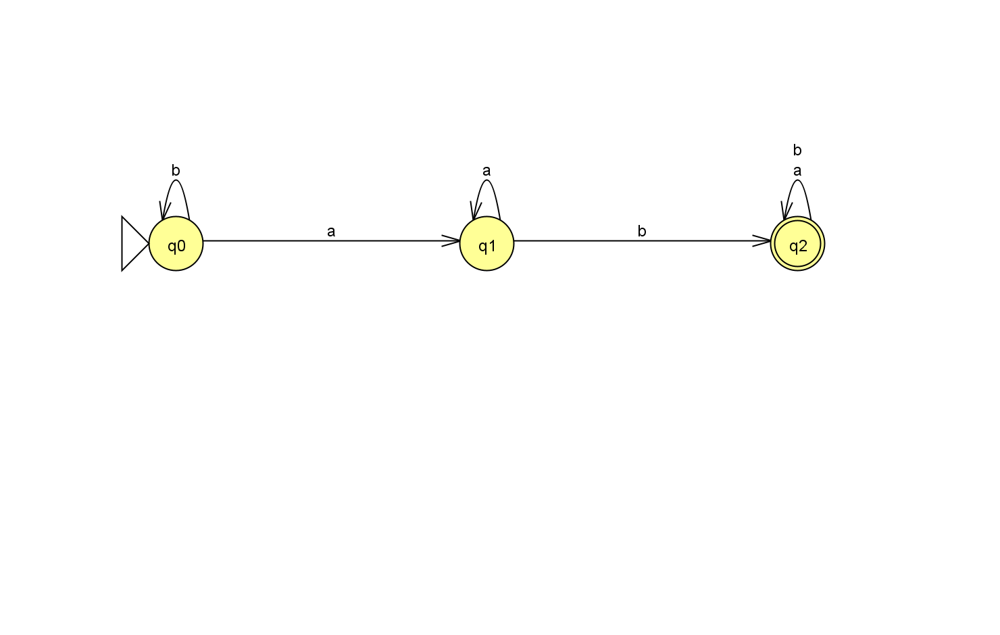
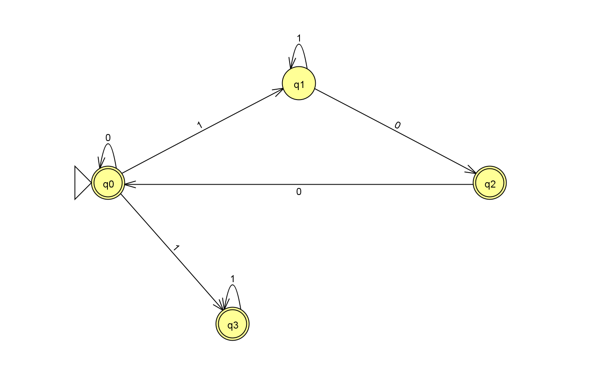

# Практическая работа № 1. Конечные автоматы

**Дисциплина:** «Теория автоматов, языков и вычислений»  
**Вариант:** 13  
**Программная реализация:** Java

## 1. Цель и постановка задачи

Цель моей работы — построить детерминированный и недетерминированный конечные автоматы, описать их формально, графически и таблично, реализовать обработку цепочек на Java и сопоставить результаты с JFLAP.

В соответствии с вариантом 13 я выполнил две задачи:

- **а)** построил ДКА над алфавитом `{a,b}`, допускающий цепочки вида `w₁abw₂`, где `w₁,w₂ ∈ {a,b}*`;
- **б)** построил НКА над алфавитом `{0,1}`, допускающий цепочки, в которых нет подцепочки `101`.

Подцепочка здесь состоит из **последовательных соседних символов**. Например, `1001` не содержит `101` и должна приниматься НКА.

При выполнении работы я соблюдал следующие требования:

1. Построить ДКА и НКА в системе JFLAP.
2. В программе обязательно использовать сущности и процедуры, относящиеся к табличному представлению автомата.
3. Не использовать функции обработки строковых данных.
4. Вывод программы должен быть внешне схож и фактически эквивалентен результату JFLAP на тех же тестовых цепочках.

Для программной реализации я выбрал Java. Отчёт оформил в Markdown, чтобы описание работы, изображения автоматов и исходные файлы можно было хранить в одном репозитории.

## 2. Теоретические основания

При построении автоматов я использовал следующие понятия. Алфавит `Σ` — конечное непустое множество символов. Цепочка — конечная последовательность символов этого алфавита. Множество `Σ*` содержит все конечные цепочки над алфавитом, включая пустую. Формальный язык `L` представляет собой подмножество `Σ*`.

Пустую цепочку я обозначаю `ε`; её длина равна 0. Пустая цепочка `ε`, пустое множество `∅` и множество `{ε}` — разные объекты: `ε` является одной цепочкой, `∅` не содержит элементов, а `{ε}` содержит ровно одну цепочку — пустую.

Каждый автомат я описываю пятёркой:

$$A=(Q,\Sigma,\delta,q_0,F),$$

где `Q` — конечное множество состояний, `Σ` — входной алфавит, `δ` — функция переходов, `q₀ ∈ Q` — начальное состояние, `F ⊆ Q` — множество допускающих состояний.

Для ДКА:

$$\delta_D:Q\times\Sigma\to Q.$$

Для каждого состояния и каждого входного символа задано ровно одно следующее состояние. Расширенная функция переходов определяется так:

$$\widehat\delta_D(q,\varepsilon)=q,\qquad
\widehat\delta_D(q,xa)=\delta_D(\widehat\delta_D(q,x),a).$$

Цепочка принимается, когда **после чтения всей цепочки** получено допускающее состояние:

$$L(D)=\{w\in\Sigma^*\mid\widehat\delta_D(q_0,w)\in F\}.$$

Для НКА без ε-переходов:

$$\delta_N:Q\times\Sigma\to 2^Q.$$

Значение функции — множество состояний, в том числе пустое. При обработке символа необходимо объединить переходы **из всех текущих состояний**:

$$\widehat\delta_N(q,\varepsilon)=\{q\},\qquad
\widehat\delta_N(q,xa)=\bigcup_{p\in\widehat\delta_N(q,x)}\delta_N(p,a).$$

Условие допуска:

$$L(N)=\{w\in\Sigma^*\mid\widehat\delta_N(q_0,w)\cap F\ne\varnothing\}.$$

Достаточно существования **одного** пути, прочитавшего всю цепочку и закончившегося в допускающем состоянии. Обрыв другой ветви не означает отказ всего НКА.

У ε-НКА дополнительно разрешены переходы без чтения символа; требуется учитывать ε-замыкания. В своём решении я не использовал ε-переходы: недетерминизм обеспечен двумя переходами по одному входному символу.

### Различие между отсутствием перехода и недетерминизмом

При построении НКА я отдельно учёл, что отсутствие перехода само по себе не создаёт выбора между несколькими состояниями. Если из каждого состояния по каждому символу выходит не более одной дуги, то из единственного начального состояния после чтения цепочки достижимо не более одного состояния. Отсутствующий переход только обрывает вычисление.

Хотя формально ДКА можно рассматривать как частный случай НКА, в части б) я построил автомат с явным недетерминированным выбором. Для этого я задал переход `δ(q₀,1)={q₁,q₃}`: по одному символу из начального состояния достижимы сразу два разных состояния.

## 3. ДКА для языка, содержащего `ab`

### 3.1. Формальное описание

$$L_a=\{w_1abw_2\mid w_1,w_2\in\{a,b\}^*\}.$$

$$D=(\{q_0,q_1,q_2\},\{a,b\},\delta_D,q_0,\{q_2\}).$$

Для распознавания подцепочки `ab` я выделил три ситуации: нужная подцепочка ещё не найдена и последнего `a` нет; подцепочка ещё не найдена, но последний символ — `a`; подцепочка уже найдена. Каждой ситуации я сопоставил отдельное состояние.

| Состояние | Смысл после чтения префикса |
|---|---|
| `q₀` | `ab` ещё нет; префикс пуст или заканчивается на `b` |
| `q₁` | `ab` ещё нет; последний символ — `a` |
| `q₂` | Подцепочка `ab` уже встретилась |

Начальным я назначил состояние `q₀`, а единственным допускающим — `q₂`.

### 3.2. Таблица и граф переходов

Здесь и далее `→` обозначает начальное состояние, `*` — допускающее.

| Состояние | `a` | `b` |
|---|---|---|
| → `q₀` | `q₁` | `q₀` |
| `q₁` | `q₁` | `q₂` |
| *`q₂` | `q₂` | `q₂` |



Построенный автомат я сохранил в файле `Variant13_DFA.jff`. Из каждого состояния по каждому символу алфавита выходит ровно один переход.

### 3.3. Обоснование корректности

Корректность ДКА я обосновал через смысл его состояний. До начала чтения префикс пуст, поэтому автомат находится в `q₀`. Если `ab` ещё не найдено, чтение `a` переводит автомат в `q₁` или оставляет его там. Чтение `b` после `q₁` завершает подцепочку `ab` и переводит автомат в `q₂`. Чтение `b` из `q₀` сохраняет отсутствие нужной подцепочки. Из `q₂` оба перехода ведут в `q₂`, поскольку дописывание символов не уничтожает уже найденное вхождение.

Таким образом, приведённый смысл состояний сохраняется после каждого символа. В конце `q₂` достигнуто тогда и только тогда, когда цепочка содержит `ab`. Значит, `L(D)=Lₐ`. Пустая цепочка отвергается.

Я также проверил минимальность ДКА: все три состояния достижимы по `ε`, `a`, `ab`; `q₂` отличается от остальных допуском пустого продолжения, а `q₀` и `q₁` различаются продолжением `b`. Поэтому объединение любых двух состояний изменило бы распознаваемый язык, и уменьшить число состояний нельзя.

## 4. НКА для языка без `101`

### 4.1. Идея построения

$$L_b=\{w\in\{0,1\}^*\mid w\text{ не содержит }101\}.$$

В цепочке без `101` между двумя блоками единиц может находиться не один, а как минимум два нуля. Один нуль после единиц допустим в конце цепочки, но следующая единица сразу создала бы `101`.

При начале блока единиц я предусмотрел две одновременно проверяемые гипотезы:

- ветвь `q₁` продолжит чтение, если после блока единиц появится нуль;
- ветвь `q₃` предполагает, что до конца цепочки остались только единицы.

Я реализовал эти гипотезы отдельными ветвями. Программа отслеживает обе ветви одновременно. Если одна из них обрывается, другая может продолжить обработку; цепочка принимается, если хотя бы одна ветвь прочитала её полностью и завершилась в допускающем состоянии.

### 4.2. Формальное описание

$$N=(\{q_0,q_1,q_2,q_3\},\{0,1\},\delta_N,q_0,\{q_0,q_2,q_3\}).$$

| Состояние | Назначение |
|---|---|
| `q₀` | Начало чтения либо безопасное окончание на нули: суффикса `10` нет |
| `q₁` | Ветвь читает блок единиц; для допуска этой ветви потребуется последующий нуль |
| `q₂` | Последние два символа — `10`; далее разрешён только `0` либо конец цепочки |
| `q₃` | Ветвь читает предполагаемый заключительный блок единиц; далее разрешены только `1` |

Начальным я назначил состояние `q₀`, а допускающими — `q₀`, `q₂`, `q₃`. **Состояние `q₁` не является допускающим.**

### 4.3. Таблица и граф переходов

| Состояние | `0` | `1` |
|---|---|---|
| → *`q₀` | `{q₀}` | `{q₁,q₃}` |
| `q₁` | `{q₂}` | `{q₁}` |
| *`q₂` | `{q₀}` | `∅` |
| *`q₃` | `∅` | `{q₃}` |



Построенный НКА я сохранил в файле `Variant13_NFA.jff`.

Из `q₀` по `1` выходят две разные дуги: в `q₁` и в `q₃`. Поэтому уже после входа `1` достижимо множество `{q₁,q₃}`. Таким образом, в построенном мной автомате действительно возникает несколько возможных состояний после чтения одного символа.

Обе ветви существенны для данной конструкции:

- без перехода `q₀ —1→ q₃` ошибочно отвергалась бы цепочка `1`, поскольку `q₁` не допускающее;
- без перехода `q₀ —1→ q₁` ошибочно отвергалась бы цепочка `10`, поскольку из `q₃` нет перехода по `0`.

Пустая ячейка `∅` означает отсутствие перехода. В `.jff` для неё не создаётся элемент `transition`. Пустое поле `read` в JFLAP означало бы ε-переход и здесь не используется.

### 4.4. Доказательство корректности через достижимые множества

Для доказательства корректности я рассмотрел все множества состояний, достижимые после чтения входных цепочек. Из начального множества `{q₀}` достижимы только четыре множества:

| Обозначение | Множество | `0` | `1` | Допускающее? |
|---|---|---|---|---|
| `A` | `{q₀}` | `A` | `B` | Да |
| `B` | `{q₁,q₃}` | `C` | `B` | Да, содержит `q₃` |
| `C` | `{q₂}` | `A` | `Z` | Да |
| `Z` | `∅` | `Z` | `Z` | Нет |

Эта таблица замкнута по обоим входным символам, поэтому иных достижимых множеств нет. `Z` — обозначение пустого множества в доказательстве, а не дополнительное состояние исходного НКА.

Далее я установил инвариант, связывающий прочитанный префикс `x` с текущим множеством состояний:

1. Если `101` уже встретилось, достижимо `Z`.
2. Если `101` нет и `x` пуст либо заканчивается на `0`, но не на `10`, достижимо `A`.
3. Если `101` нет и `x` заканчивается на `1`, достижимо `B`.
4. Если `101` нет и `x` заканчивается на `10`, достижимо `C`.

**База:** при `x=ε` достижимо `A={q₀}`.

**Переход:** из `A` символ `0` сохраняет безопасный нулевой суффикс, а `1` начинает блок единиц и даёт `B`. Из `B` очередная `1` сохраняет `B`, а `0` даёт суффикс `10` и множество `C`: ветвь `q₃` обрывается, ветвь `q₁` переходит в `q₂`. Из `C` символ `0` даёт суффикс `100`, поэтому получается `A`; символ `1` создаёт `101`, и все пути обрываются. Из `Z` никакой следующий символ не восстанавливает путь, что соответствует сохранению запрещённой подцепочки в любом продолжении.

По индукции инвариант верен для любой длины. Множества `A`, `B`, `C` содержат допускающее состояние, а `Z` не содержит состояний вообще. Следовательно,

$$\widehat\delta_N(q_0,w)\cap F\ne\varnothing
\quad\Longleftrightarrow\quad w\text{ не содержит }101.$$

Таким образом, `L(N)=L_b`. В частности, `ε` принимается, поскольку `q₀ ∈ F`. То, что НКА эквивалентен некоторому ДКА, не устраняет недетерминизм его исходного графа.

## 5. Пошаговая обработка цепочек

### ДКА: `bbaba` и `bbaaa`

```text
bbaba: q0 --b--> q0 --b--> q0 --a--> q1 --b--> q2 --a--> q2
Result: Accept

bbaaa: q0 --b--> q0 --b--> q0 --a--> q1 --a--> q1 --a--> q1
Result: Reject
```

### НКА: `1001`, `101`, `1110`

```text
1001: {q0} --1--> {q1,q3} --0--> {q2} --0--> {q0} --1--> {q1,q3}
Result: Accept (q3 is final)

101:  {q0} --1--> {q1,q3} --0--> {q2} --1--> {}
Result: Reject

1110: {q0} --1--> {q1,q3} --1--> {q1,q3} --1--> {q1,q3} --0--> {q2}
Result: Accept
```

Для `101` промежуточный префикс `1` допускается, но вся цепочка отвергается. Поэтому завершать распознавание при первом попадании в допускающее состояние нельзя.

## 6. Программная реализация

Программную реализацию я разделил на три файла:

- `Automata13.java` — таблицы и алгоритмы переходов, посимвольный ввод и вывод;
- `DFA13.java` — запуск ДКА;
- `NFA13.java` — запуск НКА.

В классе `DFA` я задал переходы таблицей. Таблица `int[][] TRANSITIONS` задаёт одно состояние для каждой пары «состояние, символ». Текущее состояние я храню целым числом. Переход выполняется выражением `state = TRANSITIONS[state][col]`.

В классе `NFA` я использовал таблицу, ячейками которой являются множества состояний. Таблица `int[][][] TRANSITIONS` хранит в каждой ячейке массив номеров состояний. Например, `TRANSITIONS[0][1] = {1,3}`. Множества текущих и следующих состояний я представил булевыми массивами `current` и `next`: значение `true` у позиции `q` означает, что состояние `q` входит в множество.

На каждом шаге НКА:

1. Находится столбец таблицы по входному символу.
2. Очищается `next`.
3. Для каждого активного `q` все элементы `TRANSITIONS[q][col]` отмечаются в `next`.
4. `current` и `next` меняются местами.

Использование отдельного массива `next` исключает ошибочную обработку одного входного символа несколько раз. Условие допуска проверяет пересечение текущего множества с массивом признаков `FINAL`.

Ввод я организовал посимвольно с помощью `Reader.read()`. В распознавателях отсутствуют `contains`, `indexOf`, `substring`, регулярные выражения, `split`, `trim`, `toCharArray` и другие методы обработки строк. Входная цепочка не накапливается в `String`. Сравнения символов используются только для поиска столбца алфавита; условие языка вычисляется по таблице переходов.

`String[] args` является стандартной сигнатурой запуска Java; при файловом вводе строка аргумента передаётся как путь к файлу. Строковые литералы используются для сообщений вывода. Это не обработка входных строк распознавателя.

Одна строка ввода соответствует одному испытанию. Пустая строка — испытание `ε`. Перед каждым испытанием я предусмотрел сброс автомата в начальное состояние. Обрабатываются окончания строк LF и CRLF, а также последняя непустая строка без завершающего перевода строки. Пустой файл не содержит испытаний.

Символ вне алфавита даёт `Reject` с пометкой `OUTSIDE_ALPHABET`. Пробелы не удаляются. Остаток ошибочной строки дочитывается, затем следующий тест начинается независимо. Символы `ε` или `λ` вводить буквально не нужно: в программе пустую цепочку задаёт пустая строка, а на экране ей соответствует `EPS`.

Для отображения результата я предусмотрел столбцы `Input`, `Result`, `States`, а результат обозначается `Accept` или `Reject`, как в проверке цепочек JFLAP. Программа моделирует автоматы; отдельный проверочный модуль не входит в алгоритм распознавания.

При фиксированном количестве состояний оба распознавателя работают за `O(n)` времени и используют `O(1)` рабочей памяти относительно длины входа. Для НКА общего вида стоимость шага зависит от числа состояний и переходов.

### Сборка и запуск

Для сборки программы требуется JDK 8 или новее. Я использовал следующую последовательность команд в каталоге с файлами работы:

```powershell
New-Item -ItemType Directory -Force classes | Out-Null
javac -encoding UTF-8 -d classes Automata13.java DFA13.java NFA13.java
java -cp classes DFA13 tests_dfa.txt
java -cp classes NFA13 tests_nfa.txt
```

Для ручного ввода:

```powershell
java -cp classes DFA13
java -cp classes NFA13
```

Запускается одна из этих команд. После каждой введённой цепочки нажимается Enter. Для завершения стандартного ввода в консоли Windows — Ctrl+Z, затем Enter.

## 7. Проверки и сопоставление с JFLAP

Для проверки я подобрал пустую цепочку, короткие слова, цепочки с повторяющимися символами и примеры с подцепочками в разных позициях. Входные данные я сохранил в файлах `tests_dfa.txt` и `tests_nfa.txt`, а результаты запуска Java — в `results_dfa.txt` и `results_nfa.txt`. Ниже приведены характерные результаты сравнения.

| Автомат | Цепочка | Результат Java | Результат симулятора JFLAP |
|---|---|---|---|
| ДКА | `ε` | Reject | Reject |
| ДКА | `ab` | Accept | Accept |
| ДКА | `ba` | Reject | Reject |
| ДКА | `bbaba` | Accept | Accept |
| ДКА | `bbaaa` | Reject | Reject |
| НКА | `ε` | Accept | Accept |
| НКА | `1` | Accept | Accept |
| НКА | `10` | Accept | Accept |
| НКА | `101` | Reject | Reject |
| НКА | `1001` | Accept | Accept |
| НКА | `11011` | Reject | Reject |
| НКА | `111000` | Accept | Accept |
| НКА | `10101` | Reject | Reject |

### Фактически выполненная проверка

Для автоматической проверки я загрузил оба файла `.jff` с помощью **XML-декодера из библиотеки JFLAP 7.1** (`XMLCodec`). Для каждого автомата я проверил все цепочки над его алфавитом длины от 0 до 12 включительно:

$$\sum_{k=0}^{12}2^k=8191.$$

Для каждой цепочки я сопоставил три результата:

1. Табличный Java-распознаватель из этой работы.
2. Симулятор `FSAStepByStateSimulator` из JFLAP 7.1.
3. Независимая проверка условия задания прямым сравнением соседних символов в проверочном модуле.

**Результат: 8191 проверка ДКА и 8191 проверка НКА, всего 16 382; расхождений нет.** Дополнительно я выполнил по шесть проверок потокового ввода каждого распознавателя: пустой ввод, пустые строки, CRLF, сброс между цепочками, EOF и посторонние символы.

С помощью детектора `FSANondeterminismDetector` из JFLAP я проверил наличие недетерминизма и получил следующие результаты:

- для ДКА: недетерминированных состояний нет;
- для НКА: одно недетерминированное состояние — `q0`.


## 8. Вывод

В ходе практической работы я построил ДКА для цепочек над `{a,b}`, содержащих подцепочку `ab`, и НКА для цепочек над `{0,1}`, не содержащих подцепочки `101`. Для обоих автоматов я составил формальные описания и таблицы переходов, построил графы и обосновал корректность распознавания.

В НКА я реализовал множественный переход `δ(q₀,1)={q₁,q₃}` и показал, почему обе ветви необходимы для выбранной конструкции. Программы на Java я реализовал с использованием таблиц переходов и последовательного чтения символов без функций обработки строк. На всех цепочках длины до 12 включительно результаты моих распознавателей совпали с результатами симулятора JFLAP и независимой проверкой условий задания.

В результате работы я закрепил навыки построения ДКА и НКА, формального описания их поведения, реализации табличных переходов и проверки корректности автоматов.
