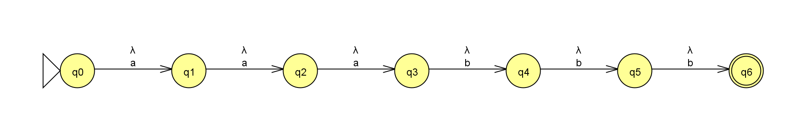
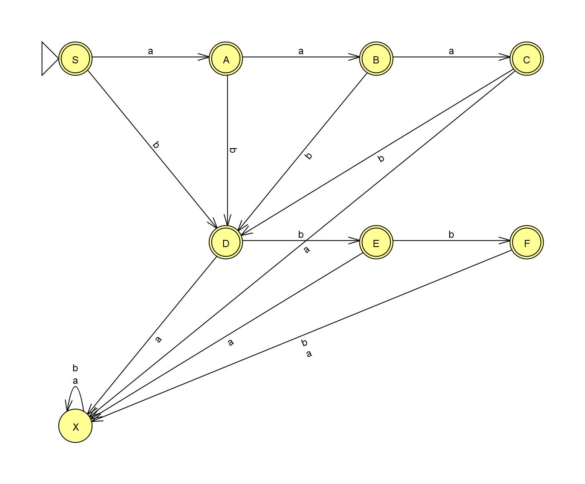

# Практическая работа № 2. Регулярные выражения, грамматики и языки

**Дисциплина:** «Теория автоматов, языков и вычислений»  
**Вариант:** 3  
**Выполнил:** Токарев Никита Александрович  
**Группа:** КИ24-16/2Б  
**Среда выполнения:** JFLAP 7.1

## 1. Цель и постановка задачи

Цель работы: построение и исследование регулярных выражений и регулярных грамматик, выполнение их преобразований в конечные автоматы и доказательство нерегулярности заданного языка с помощью леммы о разрастании.

Для частей 1 и 2 задан язык:

$$L_3=\{a^nb^m:n<4,\ m\leq3\}.$$

Для части 3 задан другой язык:

$$L_{29}=\{a^nb^la^k:n=l\ \text{или}\ l\ne k\}.$$

Показатели степеней рассматриваются как неотрицательные целые числа. Поэтому в первом языке `n` и `m` независимо принимают значения `0, 1, 2, 3`. Во втором условии `l` — латинская буква, обозначающая количество символов `b`, а слово «или» задаёт обычную логическую дизъюнкцию: достаточно выполнения хотя бы одного условия.

В ходе работы выполнены следующие задачи:

1. Построено регулярное выражение для `L₃`.
2. Получены обобщённый граф переходов и эквивалентный конечный автомат, сохранены промежуточные этапы преобразования.
3. Построена праволинейная регулярная грамматика для `L₃`.
4. Грамматика преобразована в автомат, а автомат — в регулярное выражение.
5. Проверена согласованность полученных представлений языка.
6. Разобраны примеры работы тренажёра леммы о разрастании в JFLAP.
7. Формально доказано, что `L₂₉` не является регулярным.

## 2. Теоретические сведения

### 2.1. Цепочки и языки

Алфавит `Σ` — конечное непустое множество символов. В данной работе `Σ={a,b}`. Цепочка — конечная последовательность символов алфавита; её длина обозначается `|w|`. Пустая цепочка `ε` имеет длину 0. В интерфейсе JFLAP пустая цепочка обозначается также `λ`.

Обозначение `aⁿ` означает последовательность из `n` символов `a`; при `n=0` получается `ε`. Запись `aⁿbᵐ` означает, что сначала расположены все символы `a`, а затем все символы `b`. Поэтому цепочка `aba` не имеет нужного вида, хотя количество каждого символа не превышает трёх.

Множество `Σ*` содержит все конечные цепочки над алфавитом. Формальный язык представляет собой подмножество `Σ*`. Символ `∅` означает пустое множество цепочек, а `{ε}` — язык из одной пустой цепочки. Эти два языка различны.

### 2.2. Регулярные выражения

Регулярное выражение задаёт язык с помощью следующих операций:

| Запись | Значение |
|---|---|
| `a` | Язык из одной цепочки `a` |
| `ε` | Язык `{ε}` |
| `∅` | Пустой язык |
| `R+T` | Объединение языков, описываемых `R` и `T` |
| `RT` | Конкатенация: цепочка из `R`, за которой следует цепочка из `T` |
| `R*` | Конкатенация любого неотрицательного числа цепочек из `R` |
| `(R)` | Группировка выражения |

Приоритет операций: сначала звёздочка Клини, затем конкатенация, затем объединение. Скобки позволяют явно задать группировку.

В математической записи и JFLAP символ `+` используется для объединения. Это не обозначение «одно или более повторений», применяемое в некоторых программных библиотеках регулярных выражений.

В обобщённом графе переходов дуга может быть помечена целым регулярным выражением. Переход по такой дуге соответствует чтению любой цепочки из языка её метки. Если все метки являются отдельными символами или `ε`, получается обычный ε-НКА.

### 2.3. Регулярные грамматики

Грамматика записывается в виде:

$$G=(V,\Sigma,P,S),$$

где `V` — множество нетерминалов, `Σ` — множество терминальных символов, `P` — множество правил, `S` — начальный нетерминал. Множества терминалов и нетерминалов не пересекаются.

В построенной праволинейной грамматике используются правила вида `A → aB` и `A → ε`. В правой части каждого правила находится не более одного нетерминала, причём он стоит справа от терминального символа. Правило с `ε` завершает вывод.

Регулярные выражения, регулярные грамматики и конечные автоматы задают один и тот же класс языков. Поэтому построение любого из этих представлений доказывает регулярность языка; преобразование позволяет получить остальные представления.

### 2.4. Лемма о разрастании

Если язык `L` регулярен, то существует число `p ≥ 1` такое, что любую цепочку `w ∈ L` длины не меньше `p` можно представить в виде `w=xyz`, причём:

$$|xy|\leq p,\qquad |y|>0,\qquad
\forall i\geq0:\ xy^iz\in L.$$

Число `p` фиксируется для всего языка. Часть `y` должна быть непустой и полностью лежать среди первых `p` символов цепочки. При `i=0` она удаляется, при `i=1` цепочка сохраняется, при `i=2` часть `y` повторяется дважды.

Для доказательства нерегулярности требуется для **любого** предполагаемого `p` выбрать подходящее `w`, а затем показать, что **для каждого** допустимого разбиения существует показатель `i`, при котором `xyⁱz` выходит из языка. Выбор одного удобного разбиения этого не доказывает.

Лемма даёт необходимое условие регулярности. Выполнение условия разрастания само по себе не является достаточным доказательством регулярности.

## 3. Часть 1. Регулярное выражение для языка L₃

### 3.1. Анализ языка

Из условий `n<4` и `m≤3` следует:

$$0\leq n\leq3,\qquad 0\leq m\leq3.$$

Каждой паре `(n,m)` соответствует одна цепочка. Все 16 цепочек представлены в таблице:

| `n \ m` | 0 | 1 | 2 | 3 |
|---|---|---|---|---|
| 0 | `ε` | `b` | `bb` | `bbb` |
| 1 | `a` | `ab` | `abb` | `abbb` |
| 2 | `aa` | `aab` | `aabb` | `aabbb` |
| 3 | `aaa` | `aaab` | `aaabb` | `aaabbb` |

Таким образом, язык конечен, `|L₃|=16`, а максимальная длина его цепочки равна 6. Пустая цепочка принадлежит языку при `n=m=0`.

### 3.2. Построение выражения

Сначала описываются все допустимые блоки символов `a`:

$$R_a=\varepsilon+a+aa+aaa.$$

Аналогично описываются допустимые блоки символов `b`:

$$R_b=\varepsilon+b+bb+bbb.$$

Поскольку блок `a` должен предшествовать блоку `b`, применяется конкатенация:

$$\boxed{R=(\varepsilon+a+aa+aaa)(\varepsilon+b+bb+bbb).}$$

Для ввода в JFLAP используется запись:

```text
(!+a+aa+aaa)(!+b+bb+bbb)
```

Символ `!` при вводе обозначает пустую цепочку. В сохранённом файле и на графах JFLAP отображает её как `λ`. Файл выражения — `Variant3_RE.jff`.

**Корректность.** При выборе слагаемого из первой скобки получается ровно один блок `aⁿ`, где `0≤n≤3`; из второй — блок `bᵐ`, где `0≤m≤3`. Поэтому любая полученная цепочка принадлежит `L₃`. Обратно, для любой цепочки `aⁿbᵐ ∈ L₃` в обеих скобках существуют соответствующие слагаемые. Следовательно, `L(R)=L₃`.

Также получена равносильная запись:

$$R=(\varepsilon+a)(\varepsilon+a)(\varepsilon+a)
(\varepsilon+b)(\varepsilon+b)(\varepsilon+b).$$

Здесь перенос строки не обозначает объединение: все шесть скобок соединяются **конкатенацией**. Для исключения неоднозначности запись JFLAP приведена целиком:

```text
(!+a)(!+a)(!+a)(!+b)(!+b)(!+b)
```

Каждая из первых трёх позиций либо добавляет один `a`, либо пропускается; каждая из последних трёх аналогично добавляет `b`. Файл этой формы — `Variant3_RE_optional.jff`.

### 3.3. Обобщённый граф переходов

Первоначальный граф содержит два состояния: начальное и допускающее. Единственная дуга между ними помечена выражением `R`.


Этому графу соответствует файл `steps/re_to_nfa/step_00.jff`.

Далее выражение разделяется по операции конкатенации. В укрупнённой записи получается последовательность:

```text
s --(ε+a+aa+aaa)--> u --(ε+b+bb+bbb)--> f
```


Файл укрупнённого графа — `steps/GTG_concatenation.jff`. Промежуточное состояние `u` отделяет чтение блока `a` от чтения блока `b`. Состояние `f` является единственным допускающим.

В каждом блоке объединение раскрывается на альтернативные пути для `ε`, одного, двух и трёх символов. Переходы по `aa`, `aaa`, `bb`, `bbb` раскладываются на последовательности односимвольных переходов. При соединении фрагментов используются ε-переходы.

### 3.4. Пошаговое преобразование средствами JFLAP

Преобразование исходного выражения выполнено конвертером JFLAP; каждый завершённый шаг сохранён. Для конкатенации конвертер создаёт отдельные входы и выходы фрагментов и соединяет их ε-переходами. Поэтому его результат содержит больше служебных состояний, чем укрупнённая схема.

| Шаг | Выполненное действие | Состояний | Переходов |
|---|---|---|---|
| 0 | Исходная дуга с выражением `R` | 2 | 1 |
| 1 | Преобразование метки `(λ+a+aa+aaa)(λ+b+bb+bbb)` | 6 | 5 |
| 2 | Преобразование метки `(λ+a+aa+aaa)` | 6 | 5 |
| 3 | Преобразование метки `λ+a+aa+aaa` | 14 | 16 |
| 4 | Преобразование метки `aaa` | 20 | 22 |
| 5 | Преобразование метки `(λ+b+bb+bbb)` | 20 | 22 |
| 6 | Преобразование метки `aa` | 24 | 26 |
| 7 | Преобразование метки `λ+b+bb+bbb` | 32 | 37 |
| 8 | Преобразование метки `bbb` | 38 | 43 |
| 9 | Преобразование метки `bb` | 42 | 47 |

Все файлы этой последовательности находятся в `steps/re_to_nfa`. В результате получен ε-НКА с **42 состояниями и 47 переходами**, сохранённый как `Variant3_NFA_from_RE.jff`. На его дугах остались только `a`, `b` и пустые метки, соответствующие ε-переходам.


Файлы промежуточных обобщённых графов содержат метки-выражения. Такие графы рассматриваются с семантикой регулярных выражений, а не как обычные автоматы для посимвольного запуска. Для проверки входных цепочек предназначены конечные автоматы, в именах которых есть `NFA` или `DFA`.

### 3.5. Компактный эквивалентный ε-НКА

Для наглядного описания языка дополнительно построен автомат по форме из шести необязательных символов:

$$N=(Q,\Sigma,\delta,q_0,F),$$

$$Q=\{q_0,q_1,q_2,q_3,q_4,q_5,q_6\},\qquad
\Sigma=\{a,b\},\qquad F=\{q_6\}.$$

| Состояние | `a` | `b` | `ε` |
|---|---|---|---|
| → `q₀` | `{q₁}` | `∅` | `{q₁}` |
| `q₁` | `{q₂}` | `∅` | `{q₂}` |
| `q₂` | `{q₃}` | `∅` | `{q₃}` |
| `q₃` | `∅` | `{q₄}` | `{q₄}` |
| `q₄` | `∅` | `{q₅}` | `{q₅}` |
| `q₅` | `∅` | `{q₆}` | `{q₆}` |
| *`q₆` | `∅` | `∅` | `∅` |



Файл — `Variant3_NFA_compact.jff`. На рисунке `λ` обозначает `ε`. Начальное состояние — `q₀`, допускающее — `q₆`.

Первые три участка пути допускают чтение не более трёх `a`, последние три — не более трёх `b`. Пропуск символа осуществляется ε-переходом. Вернуться из части для `b` в часть для `a` нельзя. Поэтому автомат принимает ровно `L₃`. Пустая цепочка принимается по пути из шести ε-переходов.

Например, цепочка `aab` имеет допускающий путь:

```text
q0 --a--> q1 --a--> q2 --ε--> q3 --b--> q4 --ε--> q5 --ε--> q6
```

## 4. Часть 2. Регулярная грамматика

### 4.1. Формальное описание

Построена праволинейная грамматика:

$$G=(V,\Sigma,P,S),\qquad
V=\{S,A,B,C,D,E,F\},\qquad\Sigma=\{a,b\}.$$

Начальный нетерминал — `S`. Множество правил `P`:

```text
S → aA | bD | ε
A → aB | bD | ε
B → aC | bD | ε
C → bD | ε
D → bE | ε
E → bF | ε
F → ε
```

Вертикальная черта разделяет альтернативные правила. Всего имеется **16 отдельных продукций**. В JFLAP каждая альтернатива записана отдельной строкой; у правил с `ε` правая часть пустая. Грамматика сохранена в `Variant3_Grammar.jff`. Первая продукция имеет левую часть `S`, что задаёт начальный символ при открытии файла.

### 4.2. Назначение нетерминалов

| Нетерминал | Смысл в процессе вывода |
|---|---|
| `S` | Ещё не выведено ни одного символа |
| `A` | Выведен один `a`, блок `b` ещё не начат |
| `B` | Выведены два `a`, блок `b` ещё не начат |
| `C` | Выведены три `a`, больше `a` добавлять нельзя |
| `D` | Выведен первый `b` |
| `E` | Выведены два `b` |
| `F` | Выведены три `b`; остаётся завершить вывод |

Правило с `ε` из каждого нетерминала позволяет закончить вывод на текущей длине. После появления первого `b` вывод находится в `D`, `E` или `F`; ни одно из этих состояний вывода не позволяет дописать `a`.

### 4.3. Примеры выводов

Пустая цепочка:

```text
S ⇒ ε
```

Цепочка `aaa`:

```text
S ⇒ aA ⇒ aaB ⇒ aaaC ⇒ aaa
```

Цепочка `bbb`:

```text
S ⇒ bD ⇒ bbE ⇒ bbbF ⇒ bbb
```

Цепочка `aabb`:

```text
S ⇒ aA ⇒ aaB ⇒ aabD ⇒ aabbE ⇒ aabb
```

Цепочка максимальной длины `aaabbb`:

```text
S ⇒ aA ⇒ aaB ⇒ aaaC ⇒ aaabD ⇒ aaabbE ⇒ aaabbbF ⇒ aaabbb
```

Цепочку `aaaa` вывести нельзя: после трёх `a` достигнут `C`, где нет правила с очередным `a`. Цепочку `bbbb` также вывести нельзя, поскольку из `F` разрешено только завершение. Цепочка `aba` не выводится: после первого `b` правила с `a` отсутствуют.

### 4.4. Доказательство равенства L(G)=L₃

Сначала проверяется включение `L(G) ⊆ L₃`. Последовательность вывода `S ⇒ aA ⇒ aaB ⇒ aaaC` позволяет получить от нуля до трёх символов `a`. Из любого из этих нетерминалов можно завершить вывод либо начать блок `b`. После этого возможны только правила `D → bE`, `E → bF` и завершение. Следовательно, любая выведенная терминальная цепочка имеет вид `aⁿbᵐ`, где `0≤n,m≤3`.

Для обратного включения рассматривается произвольная цепочка `aⁿbᵐ ∈ L₃`. Сначала применяются ровно `n` правил, добавляющих `a`. Если `m=0`, вывод завершается правилом с `ε`. Если `m>0`, добавляется первый `b` с переходом в `D`, затем ещё `m−1` символов `b`, после чего вывод завершается. Все необходимые правила существуют, поскольку `n,m≤3`.

Таким образом, `L(G)=L₃`, а построенная грамматика регулярна.

## 5. Преобразование грамматики в конечный автомат

### 5.1. Правило преобразования

Каждому нетерминалу сопоставлено состояние с тем же именем. Добавлено отдельное допускающее состояние `T`. Начальным состоянием назначено `S`.

Правило `U → cV` преобразуется в переход `U —c→ V`. Каждое правило `U → ε` преобразуется в переход `U —ε→ T`.

Преобразование по группам правил:

| Продукции | Полученные переходы |
|---|---|
| `S → aA`, `A → aB`, `B → aC` | `S —a→ A`, `A —a→ B`, `B —a→ C` |
| `S → bD`, `A → bD`, `B → bD`, `C → bD` | Из каждого из `S,A,B,C` переход по `b` в `D` |
| `D → bE`, `E → bF` | `D —b→ E`, `E —b→ F` |
| `U → ε`, где `U ∈ {S,A,B,C,D,E,F}` | Из каждого указанного состояния ε-переход в `T` |

В результате получен ε-НКА с **8 состояниями и 16 переходами**:

$$N_G=(\{S,A,B,C,D,E,F,T\},\{a,b\},\delta_G,S,\{T\}).$$


Файл — `Variant3_NFA_from_Grammar.jff`. Преобразование выполнено средствами JFLAP; имена и расположение состояний приведены к обозначениям грамматики.

Каждому выводу грамматики соответствует путь в автомате с теми же прочитанными терминалами. Завершающее правило с `ε` соответствует переходу в `T`. Поэтому автомат и грамматика задают один язык.

### 5.2. Эквивалентный полный ДКА

Для удобства проверки также построен полный ДКА. Поскольку из каждого состояния `S,A,B,C,D,E,F` есть ε-переход в `T`, в детерминированной форме каждое из этих состояний допускает завершение цепочки. Все запрещённые продолжения направлены в недопускающее состояние-ловушку `X`.

$$D=(\{S,A,B,C,D,E,F,X\},\{a,b\},\delta_D,S,\{S,A,B,C,D,E,F\}).$$

| Состояние | `a` | `b` |
|---|---|---|
| → *`S` | `A` | `D` |
| *`A` | `B` | `D` |
| *`B` | `C` | `D` |
| *`C` | `X` | `D` |
| *`D` | `X` | `E` |
| *`E` | `X` | `F` |
| *`F` | `X` | `X` |
| `X` | `X` | `X` |



Файл — `Variant3_DFA.jff`. Здесь `→` обозначает начальное состояние, `*` — допускающее. Для каждой пары «состояние, символ» задан ровно один переход. Пустая цепочка принимается, поскольку `S` допускающее.

Примеры обработки:

```text
aaabbb: S --a--> A --a--> B --a--> C --b--> D --b--> E --b--> F   Accept
aaaa:   S --a--> A --a--> B --a--> C --a--> X                   Reject
aba:    S --a--> A --b--> D --a--> X                           Reject
bbbb:   S --b--> D --b--> E --b--> F --b--> X                   Reject
```

## 6. Преобразование автомата из грамматики в РВ

### 6.1. Метод исключения состояний

Для обратного преобразования используется автомат с начальным состоянием `S` и единственным допускающим состоянием `T`. Его переходы рассматриваются как метки обобщённого графа. Отсутствующие переходы обозначаются `∅`; метки параллельных дуг объединяются операцией `+`.

При исключении промежуточного состояния `K` метка перехода из `I` в `J` заменяется по формуле:

$$R'_{IJ}=R_{IJ}+R_{IK}(R_{KK})^*R_{KJ}.$$

Вторая часть формулы описывает все пути через исключаемое состояние. У рассматриваемого автомата нет циклов, поэтому `R_KK=∅` и `(∅)*=ε`. Состояния исключаются в следующем порядке: `A`, `B`, `C`, `D`, `E`, `F`.

### 6.2. Пошаговое исключение

Исходные переходы из `S`: `S —a→ A`, `S —b→ D`, `S —ε→ T`.

| Шаг | Исключённое состояние | Новые существенные метки из `S` |
|---|---|---|
| 1 | `A` | В `B`: `aa`; в `D`: `b+ab`; в `T`: `ε+a` |
| 2 | `B` | В `C`: `aaa`; в `D`: `b+ab+aab`; в `T`: `ε+a+aa` |
| 3 | `C` | В `D`: `U=b+ab+aab+aaab`; в `T`: `V=ε+a+aa+aaa` |
| 4 | `D` | В `E`: `Ub`; в `T`: `V+U` |
| 5 | `E` | В `F`: `Ubb`; в `T`: `V+U+Ub` |
| 6 | `F` | В `T`: `V+U+Ub+Ubb` |

Здесь `U` и `V` — временные обозначения выражений, а не входные символы и не состояния.

Например, при удалении `A` путь `S —a→ A —b→ D` добавляет к прямому переходу `S —b→ D` альтернативу `ab`. Поэтому новая метка равна `b+ab`. Аналогично путь `S —a→ A —ε→ T` добавляет `a` к метке `ε` на переходе в `T`.

Все этапы сохранены в `steps/grammar_to_re`: `step_00.jff` содержит исходный обобщённый граф, файлы `step_01.jff`–`step_06.jff` — результаты исключения состояний.

### 6.3. Полученное выражение

Поскольку `U=Vb`, итоговое выражение упрощается:

$$V+U+Ub+Ubb=V+Vb+Vbb+Vbbb
=V(\varepsilon+b+bb+bbb).$$

После подстановки `V` получается:

$$\boxed{R_G=(\varepsilon+a+aa+aaa)(\varepsilon+b+bb+bbb).}$$

Оно совпадает с выражением, построенным в части 1. Неупрощённый результат конвертера сохранён в `Variant3_RE_from_Grammar.jff`:

```text
λ+a+aa+aaa+b+ab+aab+aaab+(b+ab+aab+aaab)b+(b+ab+aab+aaab)bb
```

Таким образом, выполнены обе последовательности преобразований:

```text
Регулярное выражение → обобщённый граф → ε-НКА
Регулярная грамматика → ε-НКА → обобщённый граф → регулярное выражение
```

## 7. Проверка результатов

### 7.1. Контрольные цепочки

Все 16 цепочек из таблицы раздела 3.1 должны приниматься каждым представлением `L₃`. Дополнительно проверены следующие граничные случаи и нарушения условий:

| Цепочка | Ожидаемый результат | Причина |
|---|---|---|
| `ε` | Accept | `n=m=0` |
| `aaa` | Accept | `n=3`, `m=0` |
| `bbb` | Accept | `n=0`, `m=3` |
| `aaabbb` | Accept | Максимальные допустимые значения `n=m=3` |
| `aaaa` | Reject | `n=4` нарушает `n<4` |
| `bbbb` | Reject | `m=4` нарушает `m≤3` |
| `aaaab` | Reject | Четыре символа `a` |
| `abbbb` | Reject | Четыре символа `b` |
| `ba` | Reject | Символ `a` расположен после `b` |
| `aba` | Reject | Нарушен порядок блоков |
| `baba` | Reject | Чередование символов не имеет вида `aⁿbᵐ` |
| `aabbaa` | Reject | После блока `b` снова появляются `a` |
| `aaabbbb` | Reject | Семь символов; четыре из них — `b` |

### 7.2. Автоматическая проверка средствами JFLAP

Созданные JFF-файлы загружены штатным XML-декодером JFLAP 7.1. Для проверки использован штатный симулятор конечных автоматов JFLAP.

Для всех цепочек над `{a,b}` длины от 0 до 10 включительно сопоставлены:

1. Автомат, полученный JFLAP из исходного РВ.
2. Компактный ε-НКА.
3. Полный ДКА.
4. Автомат, полученный из грамматики.
5. Автомат, полученный JFLAP из РВ после обратного преобразования грамматического автомата.
6. Принадлежность множеству цепочек, полностью выведенных из грамматики.
7. Независимую проверку условия `aⁿbᵐ`, `0≤n,m≤3`.

Количество рассмотренных цепочек:

$$\sum_{j=0}^{10}2^j=2047.$$

**Все результаты совпали.** Полное раскрытие грамматики дало ровно 16 терминальных цепочек. Для каждого из 17 сохранённых этапов двух автоматических преобразований дополнительно проверены все 255 цепочек длины от 0 до 7 с интерпретацией меток как РВ. Получилось **4335 проверок промежуточных графов без расхождений**.

Проверки выполнены программным обращением к компонентам JFLAP; графы в отчёте также отрисованы его компонентом. Результаты находятся в каталоге `verification`. Конечный перебор подтверждает согласованность файлов, а доказательства из предыдущих разделов обосновывают результат для цепочек любой длины.

## 8. Работа с тренажёром леммы о разрастании

Рассмотрены два встроенных примера тренажёра JFLAP: регулярный язык чётного числа символов `a` и нерегулярный язык `aⁿbⁿ`. Проверки разбиений и разрастаний выполнены программным вызовом тех же компонентов тренажёра. Сохранённые состояния примеров можно открыть в JFLAP как JFF-файлы.

### 8.1. Регулярный пример

Рассмотренный язык:

$$L_{even}=\{a^{2r}:r\geq0\}.$$

Он регулярен, поскольку задаётся выражением `(aa)*`. Для проверки свойства разрастания можно взять `p=2`. Любое слово этого языка длины не меньше двух имеет разбиение:

$$x=\varepsilon,\qquad y=aa,\qquad z=a^{2r-2}.$$

Тогда для любого `i≥0` длина `xyⁱz` равна `2i+2r−2`, то есть остаётся неотрицательной и чётной.

В конкретном примере тренажёра заданы `w=aaaa`, `x=ε`, `y=aa`, `z=aa`:

| `i` | `xyⁱz` | Принадлежность языку |
|---|---|---|
| 0 | `aa` | Да |
| 1 | `aaaa` | Да |
| 2 | `aaaaaa` | Да |
| 3 | `aaaaaaaa` | Да |

Состояние примера сохранено в `pumping/Example_regular_even_a.jff` с `i=0`. Регулярность здесь установлена выражением `(aa)*`; разбиение дополнительно показывает выполнение необходимого свойства.

### 8.2. Нерегулярный пример

Для языка:

$$L_{eq}=\{a^nb^n:n\geq0\}$$

в тренажёре рассмотрены `p=4`, `w=aaaabbbb`, `x=a`, `y=a`, `z=aabbbb`.

| `i` | `xyⁱz` | Принадлежность языку |
|---|---|---|
| 0 | `aaabbbb` | Нет: три `a` и четыре `b` |
| 1 | `aaaabbbb` | Да |
| 2 | `aaaaabbbb` | Нет: пять `a` и четыре `b` |
| 3 | `aaaaaabbbb` | Нет: шесть `a` и четыре `b` |

Файл — `pumping/Example_nonregular_anbn.jff`, сохранён при `i=0`.

Общий принцип этого примера: в слове `aᵖbᵖ` любое допустимое `y` состоит только из `a`; его повторение изменяет число `a`, сохраняя число `b`. Конкретный запуск иллюстрирует принцип, но формальное доказательство требует рассмотреть произвольное `p` и все допустимые разбиения.

### 8.3. Свойство разрастания для L₃

Регулярность `L₃` уже доказана построенными РВ, грамматикой и автоматами. Для этого конечного языка можно выбрать `p=7`: в нём нет цепочек длины не меньше 7. Поэтому требование леммы для таких цепочек выполняется автоматически. Это не даёт обратного вывода о регулярности: основным доказательством остаются построенные представления.

## 9. Часть 3. Доказательство нерегулярности L₂₉

### 9.1. Исходное условие

$$L_{29}=\{a^nb^la^k:n=l\ \text{или}\ l\ne k\}.$$

Для цепочки вида `aⁿbˡaᵏ` условие принадлежности ложно только тогда, когда одновременно выполняются:

$$n\ne l\qquad\text{и}\qquad l=k.$$

При разрастании требуется получить именно такую цепочку. Изменить только первое равенство недостаточно, если вторая часть дизъюнкции при этом остаётся истинной.

### 9.2. Предположение о регулярности и выбор цепочки

Предположим противное: язык `L₂₉` регулярен. Тогда существует длина разрастания `p≥1`, удовлетворяющая лемме.

Выбирается цепочка:

$$w=a^pb^pa^p.$$

Она принадлежит `L₂₉`, поскольку для неё `n=l=p`. Второе условие `l≠k` ложно, так как `l=k=p`, однако для принадлежности достаточно первого условия. Длина цепочки `|w|=3p≥p`.

### 9.3. Произвольное допустимое разбиение

Рассмотрим **любое** разбиение:

$$w=xyz,\qquad |xy|\leq p,\qquad |y|>0.$$

Первые `p` символов выбранной цепочки — только `a`. Поэтому части `x` и `y` целиком лежат в первом блоке `a`. Существуют целые `r,s` такие, что:

$$x=a^r,\qquad y=a^s,\qquad
z=a^{p-r-s}b^pa^p,$$

$$r\geq0,\qquad s\geq1,\qquad r+s\leq p.$$

Эта запись охватывает все допустимые разбиения: `y` не может захватить символ `b`, потому что весь префикс `xy` ограничен первыми `p` позициями.

### 9.4. Разрастание

Для любого такого разбиения выбирается один и тот же показатель `i=2`. Получается:

$$xy^2z=a^r(a^s)^2a^{p-r-s}b^pa^p
=a^{p+s}b^pa^p.$$

У полученной цепочки:

$$n'=p+s,\qquad l'=p,\qquad k'=p.$$

Так как `s≥1`, первое условие не выполняется:

$$n'=p+s\ne p=l'.$$

Второе условие тоже не выполняется:

$$l'=p=k',\qquad\text{следовательно, }l'\ne k'\text{ ложно}.$$

Обе части дизъюнкции ложны. Значит,

$$xy^2z\notin L_{29}.$$

При этом блок `bᵖ` непустой, поскольку `p≥1`. Поэтому он однозначно отделяет первый блок `a` от последнего: изменить значения `n'`, `l'`, `k'` другим разбиением на три блока нельзя.

### 9.5. Противоречие и результат

Таким образом, для любого предполагаемого `p` существует цепочка `aᵖbᵖaᵖ ∈ L₂₉`, для которой **каждое** допустимое разбиение нарушает условие леммы уже при `i=2`.

Это противоречит требованию `xyⁱz ∈ L₂₉` для всех `i≥0`. Следовательно, исходное предположение неверно:

$$\boxed{L_{29}\text{ не является регулярным языком}.}$$

Поэтому для `L₂₉` не существует регулярного выражения, регулярной грамматики или конечного автомата, распознающего в точности этот язык. Для этой части результатом является формальное доказательство; JFF-файл с конечным автоматом для `L₂₉` не создаётся.

### 9.6. Числовая иллюстрация

При `p=3` получается `w=aaabbbaaa`. В любом допустимом разбиении длина `y` равна 1, 2 или 3, и `y` состоит из `a`. При `i=2`:

| `|y|` | Полученная цепочка | `n'` | `l'` | `k'` | `n'=l'` | `l'≠k'` |
|---|---|---|---|---|---|---|
| 1 | `aaaabbbaaa` | 4 | 3 | 3 | Ложно | Ложно |
| 2 | `aaaaabbbaaa` | 5 | 3 | 3 | Ложно | Ложно |
| 3 | `aaaaaabbbaaa` | 6 | 3 | 3 | Ложно | Ложно |

Положение `y` внутри первого блока на итоговое количество `a` не влияет. В дополнительной программной проверке перебраны все допустимые длины `x` и `y` для `p=1,…,30`: все 4960 рассмотренных разбиений дали выход из языка при `i=2`. Этот перебор служит иллюстрацией; доказательство для всех `p` дано выше.

## 10. Состав файлов и порядок открытия

| Файл или каталог | Назначение |
|---|---|
| `README.md` | Отчёт, формальные описания, преобразования и доказательство |
| `Variant3_RE.jff` | Исходное РВ для `L₃` |
| `Variant3_RE_optional.jff` | Равносильное РВ из шести необязательных символов |
| `Variant3_Grammar.jff` | Праволинейная грамматика |
| `Variant3_NFA_from_RE.jff` | ε-НКА, полученный конвертером JFLAP из исходного РВ |
| `Variant3_NFA_compact.jff` | Компактный эквивалентный ε-НКА |
| `Variant3_NFA_from_Grammar.jff` | ε-НКА, полученный из грамматики |
| `Variant3_DFA.jff` | Эквивалентный полный ДКА |
| `Variant3_RE_from_Grammar.jff` | РВ, полученное исключением состояний автомата грамматики |
| `steps` | Обобщённые графы и сохранённые этапы преобразований |
| `pumping` | Два сохранённых встроенных примера тренажёра |
| `images` | Изображения графов для отчёта |
| `verification` | Протоколы и вспомогательный код воспроизводимой проверки |

Файлы JFF открываются через `File → Open`. Для исходного РВ можно повторить `Convert → Convert to NFA` и последовательно выполнить `Do Step`. Для грамматики доступно преобразование `Convert → Convert to NFA`. Чтобы повторить получение РВ из автомата грамматики, используется `Convert → Convert FA to RE` с объединением переходов и исключением состояний.

Контрольные цепочки проверяются на конечном автомате через `Input → Multiple Run`. Для `ε` используется `Enter Lambda`. Обозначения `ε` и `λ` не нужно вводить как буквальные входные символы алфавита `{a,b}`.

Вспомогательный Java-код в `verification` создаёт и проверяет модели через библиотеку JFLAP. Он не требуется для открытия готовых файлов. Отдельная программа-распознаватель для этой практической работы не является обязательной частью решения.

## 11. Вывод

В ходе практической работы построены регулярное выражение и праволинейная регулярная грамматика для языка `L₃={aⁿbᵐ:n<4,m≤3}`. Показано, что язык содержит 16 цепочек, включая пустую; получены эквивалентные конечные автоматы.

Выполнены преобразование РВ в ε-НКА, преобразование грамматики в автомат и обратное преобразование автомата в РВ. Полученное выражение после упрощения совпало с исходным. Проверка всех 2047 цепочек длины до 10 и промежуточных графов не выявила расхождений.

На примерах тренажёра разобраны допустимые разбиения цепочек и влияние повторения части `y`. Для языка `L₂₉={aⁿbˡaᵏ:n=l или l≠k}` формально доказана нерегулярность: в цепочке `aᵖbᵖaᵖ` повторение любой допустимой части `y` нарушает оба условия принадлежности языку.

В результате работы освоены построение регулярных выражений и грамматик, преобразование представлений регулярных языков и применение леммы о разрастании для доказательства нерегулярности.
