# Практическая работа № 3. Автоматы с магазинной памятью, контекстно-свободные грамматики и языки

**Дисциплина:** «Теория автоматов, языков и вычислений»  
**Вариант:** 2  
**Среда выполнения:** JFLAP 7.1

## 1. Цель работы и постановка задачи

Цель работы — построить и исследовать автомат с магазинной памятью (МПА) и контекстно-свободную грамматику (КСГ), проверить распознавание тестовых цепочек и формально установить, является ли заданный язык контекстно-свободным.

По варианту 2 требуются три независимые части:

1. Построить в JFLAP МПА для языка
   $$L_2=\{ww^R:w\in\{a,b\}^*,\ |ww^R|\text{ — нечётное число}\}.$$
2. Построить в JFLAP КСГ для языка
   $$L_{18}=\{a^nb^m:n\ne m-1,\ n,m\geq0\}.$$
3. Формально доказать контекстно-свободность или её отсутствие для языка
   $$L_{34}=\{ww^Rw:w\in\{a,b\}^*\}.$$

Здесь $w^R$ обозначает запись цепочки $w$ в обратном порядке, а $\varepsilon$ — пустую цепочку. Пустая цепочка не совпадает с пустым языком $\varnothing$.

## 2. МПА для $L_2$

### 2.1. Свойство заданного языка

Для любой цепочки $w$ выполнено $|w^R|=|w|$. Следовательно,

$$|ww^R|=|w|+|w^R|=2|w|,$$

то есть длина $ww^R$ всегда чётна. При $w=\varepsilon$ она равна нулю и также чётна. Поэтому условие нечётной длины невыполнимо и **$L_2=\varnothing$**. Запись варианта сохранена без изменения; она не заменяется языком нечётных палиндромов.

### 2.2. Формальное описание и критерий принятия

Файл [Variant2_PDA.jff](Variant2_PDA.jff) содержит МПА

$$P=(Q,\Sigma,\Gamma,\delta,q_0,Z,F),$$

где $Q=\{q_0\}$, $\Sigma=\{a,b\}$, $\Gamma=\{Z\}$, $q_0$ — начальное состояние, $Z$ — начальный символ магазина, $F=\varnothing$. Функция переходов задана только двумя правилами:

$$\delta(q_0,a,Z)=\{(q_0,Z)\},\qquad
\delta(q_0,b,Z)=\{(q_0,Z)\}.$$

Каждый переход читает один входной символ и сохраняет $Z$ в магазине. **Критерий принятия — по заключительному состоянию после полного чтения входа.** Заключительных состояний нет, поэтому МПА отвергает любую цепочку, в том числе $\varepsilon$. Таким образом, $L(P)=\varnothing=L_2$.

Граф переходов, открытый в JFLAP:

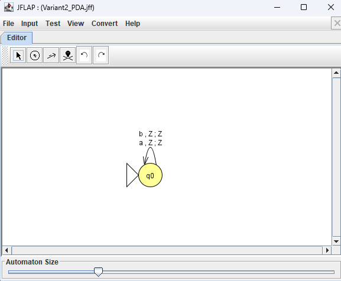

### 2.3. Проверка цепочек

Пошаговый режим JFLAP: **Input → Step…**, способ принятия **Final State**. Для цепочки `abba` последовательность конфигураций, определяемая правилами $\delta$, имеет вид

$$
(q_0,abba,Z)\vdash(q_0,bba,Z)\vdash(q_0,ba,Z)
\vdash(q_0,a,Z)\vdash(q_0,\varepsilon,Z).
$$

Последняя конфигурация не является допускающей, поскольку $q_0\notin F$. Для `a` также получается $(q_0,a,Z)\vdash(q_0,\varepsilon,Z)$ с тем же итогом. У $\varepsilon$ переходов нет, а начальное состояние не заключительное.

| Вход | Результат | Основание |
|---|---|---|
| $\varepsilon$ | Reject | $q_0\notin F$ |
| `a` | Reject | после чтения `a` состояние $q_0\notin F$ |
| `abba` | Reject | после чтения всех символов состояние $q_0\notin F$ |

На снимках JFLAP исходная строка `abba` отображается целиком: **серые символы уже прочитаны**, а чёрные составляют непрочитанный остаток. Содержимое магазина на всех шагах — `Z`.

| Шаг | Прочитано | Осталось | Перехват экрана JFLAP |
|---:|---|---|---|
| 0 | $\varepsilon$ | `abba` | 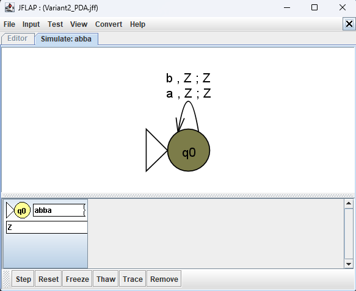 |
| 1 | `a` | `bba` |  |
| 2 | `ab` | `ba` |  |
| 3 | `abb` | `a` | 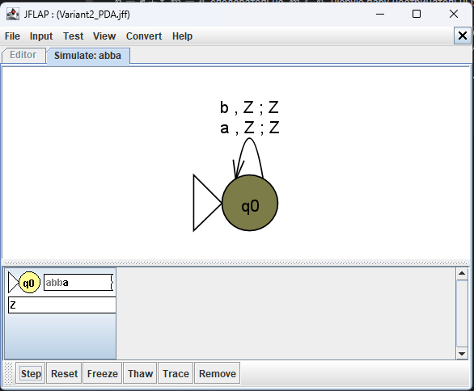 |
| 4 | `abba` | $\varepsilon$ | 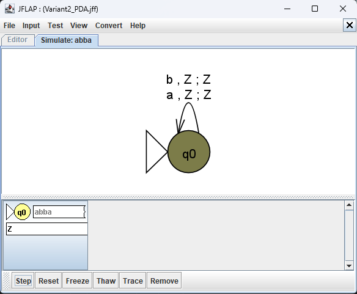 |
| 5 | `abba` | $\varepsilon$ | 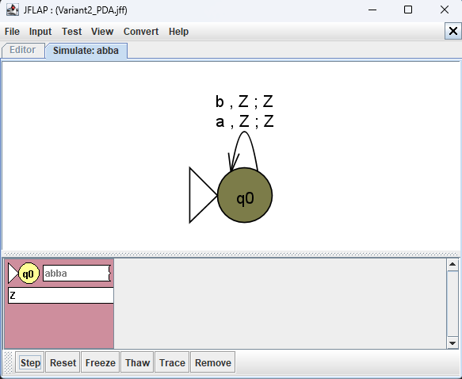 |

На последнем снимке конфигурация помечена красным: вход прочитан, но $q_0$ не является заключительным состоянием. Для двух других цепочек также зафиксированы начальная конфигурация и отклонение:

| Цепочка | Начальная конфигурация | Отклонение |
|---|---|---|
| `a` | 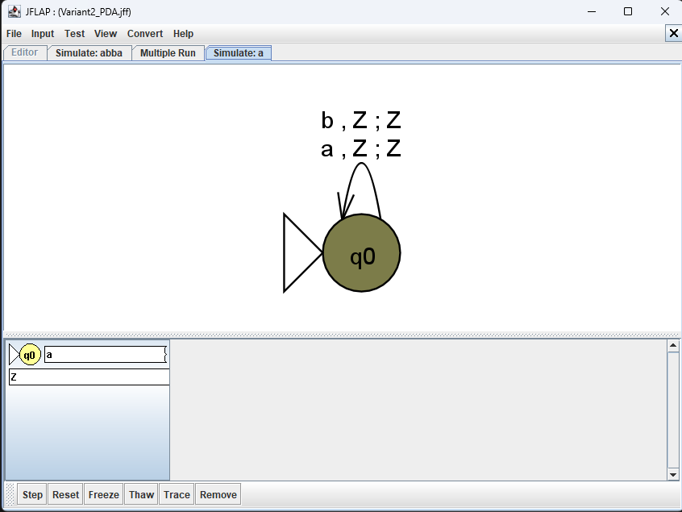 | 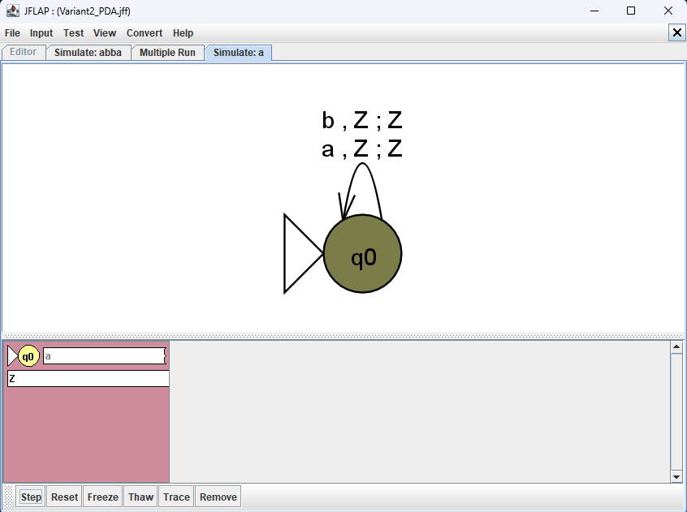 |
| $\varepsilon$ | 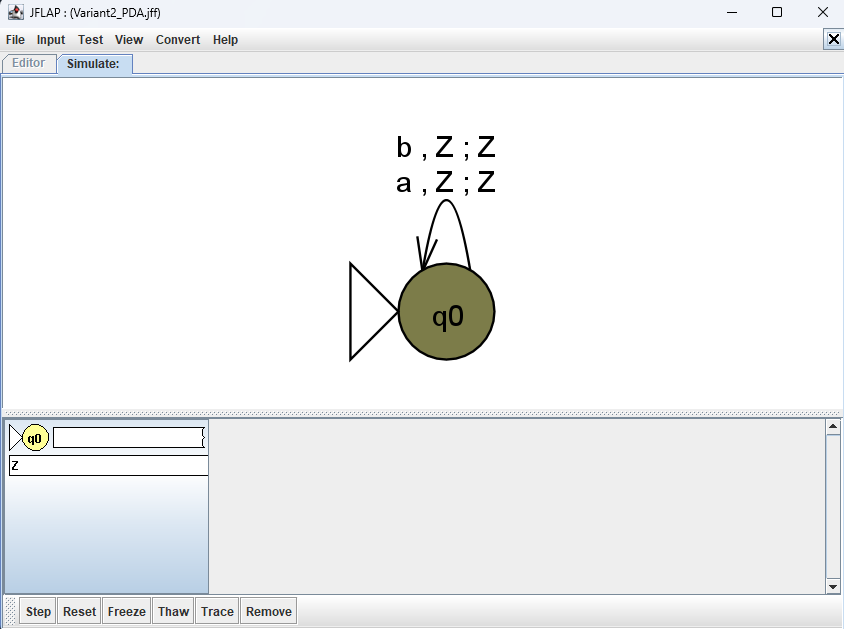 |  |

## 3. КСГ для $L_{18}$

Условие $n\ne m-1$ равносильно $m\ne n+1$. Так как $n,m\geq0$, язык распадается на две части: $m\leq n$ и $m\geq n+2$.

КСГ $G=(V,\Sigma,P,S)$ задана множествами $V=\{S,L,A,H,B\}$ и $\Sigma=\{a,b\}$ и следующими правилами:

```text
S → L | H
L → aLb | A
A → aA | ε
H → aHb | bbB
B → bB | ε
```

В файле [Variant2_Grammar.jff](Variant2_Grammar.jff) пустая правая часть правил `A` и `B` показана JFLAP символом `λ`, что соответствует $\varepsilon$.

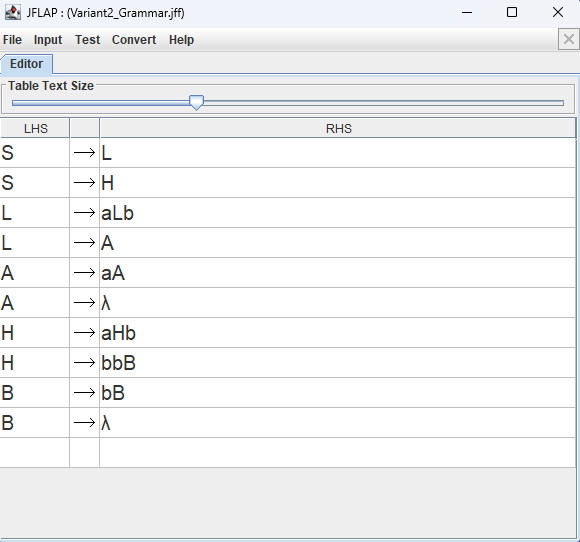

**Корректность грамматики.** Ветвь $L$ после $k\geq0$ применений $L\to aLb$ и $t\geq0$ применений $A\to aA$ выводит ровно $a^{k+t}b^k$. Для неё $n=k+t$, $m=k$, следовательно, $m\leq n$. Любую пару неотрицательных $n,m$ с $m\leq n$ можно получить, взяв $k=m$, $t=n-m$.

Ветвь $H$ после $k\geq0$ применений $H\to aHb$ и $t\geq0$ применений $B\to bB$ выводит ровно $a^kb^{k+2+t}$. Для неё $n=k$, $m=k+2+t$, следовательно, $m\geq n+2$. Любую пару с таким условием можно получить, взяв $k=n$, $t=m-n-2$.

Итак, $L(G)=\{a^nb^m:m\leq n\text{ или }m\geq n+2\}=L_{18}$. Цепочки с $m=n+1$ не выводятся.

## 4. Проверка цепочек с помощью КСГ

Проверка выполнена в JFLAP командой **Input → Brute Force Parse**. Для принятых цепочек просмотрены шаги построения дерева вывода.

| Цепочка | $n$ | $m$ | Ожидаемый и полученный результат |
|---|---:|---:|---|
| `aaab` | 3 | 1 | Accept: $m\leq n$ |
| `abbb` | 1 | 3 | Accept: $m\geq n+2$ |
| `bbb` | 0 | 3 | Accept: $m\geq n+2$ |
| `b` | 0 | 1 | Reject: $m=n+1$ |
| `abb` | 1 | 2 | Reject: $m=n+1$ |
| `aabbb` | 2 | 3 | Reject: $m=n+1$ |

Например, вывод `aaab` проходит через ветвь $L$:

$$S\Rightarrow L\Rightarrow aLb\Rightarrow aAb
\Rightarrow aaAb\Rightarrow aaaAb\Rightarrow aaab.$$

Вывод `abbb` проходит через ветвь $H$:

$$S\Rightarrow H\Rightarrow aHb\Rightarrow abbBb\Rightarrow abbb.$$

Перехваты пошагового разбора принятых цепочек:

| Цепочка | Промежуточный шаг | Завершённый вывод |
|---|---|---|
| `aaab` | 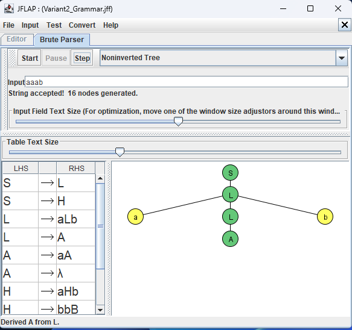 | 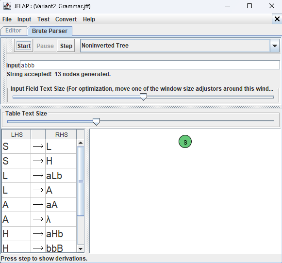 |
| `abbb` | 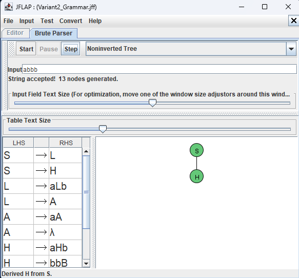 | 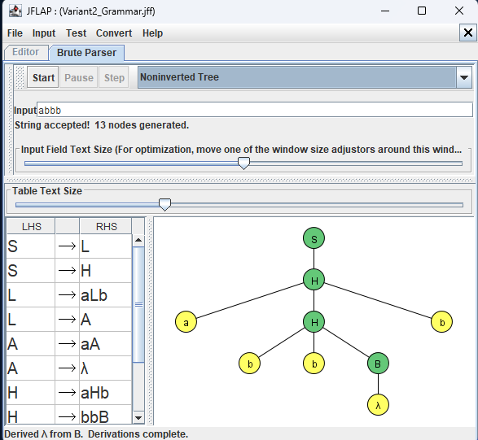 |

Для `bbb` также получен завершённый вывод:

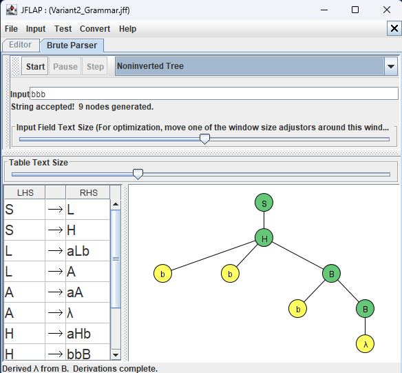

Перехваты отклонения цепочек, нарушающих условие $n\ne m-1$:

| `b` | `abb` | `aabbb` |
|---|---|---|
| 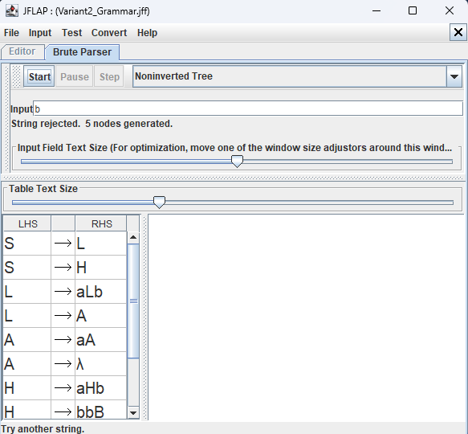 | 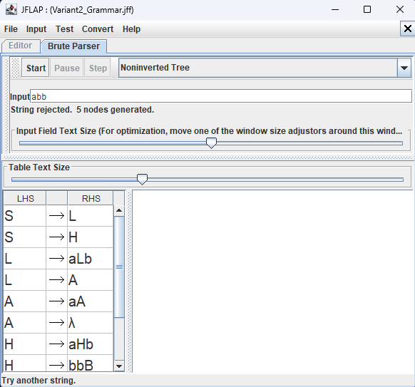 | 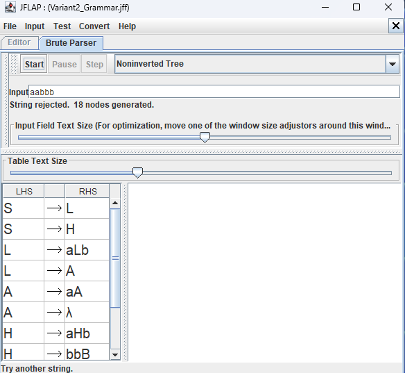 |

## 5. Формальное доказательство, что $L_{34}$ не является контекстно-свободным

Предположим противное: $L_{34}$ контекстно-свободен. Тогда для него существует длина разрастания $p\geq1$ по лемме о разрастании для контекстно-свободных языков. Выберем

$$w=a^{2p}b^{2p},\qquad
s=ww^Rw=a^{2p}b^{4p}a^{4p}b^{2p}\in L_{34}.$$

Для любого разбиения $s=uvxyz$, удовлетворяющего условиям леммы $|vxy|\leq p$ и $|vy|>0$, рассмотрим накачку с показателем $i=0$, то есть цепочку $uxz$. Каждая из четырёх однородных групп в $s$ имеет длину не меньше $2p$. Поэтому участок $vxy$ длины не более $p$ может лежать внутри одной группы или пересекать только одну границу между двумя соседними группами. Удаление $v$ и $y$ меняет длину хотя бы одной и не более двух соседних групп. Все группы сохраняются непустыми, поскольку из каждой удаляется не более $p<2p$ символов.

Докажем свойство любой цепочки из $L_{34}$, имеющей ровно четыре непустые группы вида $a^+b^+a^+b^+$. Если $r$ — число максимальных групп одинаковых символов в $w$, то в $ww^Rw$ число групп равно $3r-2$: при соединении $w$ с $w^R$ и затем с $w$ по одной паре крайних групп сливается. Из равенства $3r-2=4$ следует $r=2$. Следовательно, $w=a^j b^k$ для некоторых $j,k\geq1$, а вся цепочка обязательно имеет вид

$$a^j b^{2k}a^{2j}b^k.$$

Значит, длина третьей группы должна быть удвоенной длиной первой, а длина второй — удвоенной длиной четвёртой. Эти пары групп не являются соседними. После удаления $v$ и $y$ изменена хотя бы одна группа, но одновременно с ней не может измениться её парная группа: участок $vxy$ затрагивает не более двух соседних групп. Поэтому хотя бы одно из двух обязательных равенств нарушено. Следовательно, $uxz\notin L_{34}$.

Противоречие получено **для любого** допустимого разбиения $s=uvxyz$ при одном и том же показателе $i=0$. По лемме о разрастании $L_{34}$ не является контекстно-свободным языком.

## 6. Программная реализация МПА на Java (бонусный пункт)

Файл [src/Variant2PDA.java](src/Variant2PDA.java) реализует МПА для $L_2$. В программе явно представлены все компоненты формальной семёрки $P=(Q,\Sigma,\Gamma,\delta,q_0,Z,F)$ из раздела 2.2: множества состояний и алфавитов, таблица переходов, начальное состояние, начальный символ магазина и множество заключительных состояний. Каждая конфигурация хранит текущее состояние, позицию во входной цепочке и содержимое магазина; вершина магазина расположена слева. Переход снимает символ с вершины и помещает на неё указанную в таблице строку. Возможные конфигурации обходятся последовательно, поэтому механизм применим и при наличии нескольких переходов из одной конфигурации.

**Критерий принятия программного МПА — по заключительному состоянию:** вход должен быть прочитан полностью, а текущее состояние должно принадлежать $F$. Для варианта 2 множество $F=\varnothing$, поэтому программа не принимает ни одной цепочки. Это соответствует JFLAP-файлу [Variant2_PDA.jff](Variant2_PDA.jff) и доказанному равенству $L_2=\varnothing$. Результат получается применением переходов и проверкой критерия принятия, без отдельной проверки чётности длины или вида цепочки.

При наличии JDK программа запускается из каталога `PR3` командами:

```text
javac -encoding UTF-8 src/Variant2PDA.java
java -cp src Variant2PDA eps a abba
```

Аргумент `eps` обозначает пустую цепочку. Без аргументов программа читает цепочки построчно из стандартного ввода; пустая строка означает $\varepsilon$, а команда `exit` завершает ввод. Для каждой цепочки выводятся посещённые конфигурации и результат `Accept` или `Reject`. Например, для `abba` программа выводит конфигурации с непрочитанными остатками `abba`, `bba`, `ba`, `a`, $\varepsilon$ и результат `Reject`.

Проверка программной реализации охватила все 511 цепочек над $\{a,b\}$ длиной от 0 до 8: каждая отвергнута. Отдельно проверена полная трасса `abba`, включая четыре перехода. Результаты совпадают с формальным описанием МПА и проверками в JFLAP.
