# Практическая работа № 4. Синтаксический анализ контекстно-свободных языков

**Дисциплина:** «Теория автоматов, языков и вычислений»  
**Вариант:** 15  
**Выполнил:** Токарев Никита Александрович  
**Группа:** КИ24-16/2Б  
**Среда выполнения:** JFLAP 7.1, Java

## 1. Цель работы и постановка задачи

Цель работы — исследование свойств универсальных алгоритмов синтаксического анализа контекстно-свободных языков.

По варианту 15 требуется построить грамматику языка оператора присваивания, в правой части которого задано логическое выражение. Элементами выражений являются целочисленные константы в восьмеричной системе счисления, имена переменных из одного символа от `g` до `l`, знаки операций и скобки для изменения порядка вычисления подвыражений. Операции в порядке уменьшения приоритета: отрицание, мультипликативные, аддитивные, присваивание.

Используются обозначения `!` для отрицания, `&` для логического умножения (конъюнкции), `|` для логического сложения (дизъюнкции), `=` для присваивания. Скобки для группировки — `[` и `]`. Круглые скобки зарезервированы внутренним преобразователем НФХ в JFLAP 7.1; выбор квадратных скобок позволяет использовать режим CYK. В условии варианта тип скобок не определён.

Необходимо получить КСГ в нормальной форме Хомского, проверить не менее десяти цепочек методом Кока—Янгера—Касами в JFLAP, а для бонусных пунктов реализовать алгоритмы Кока—Янгера—Касами и Эрли и приложить исходный код, инструкции и иллюстрации использования.

## 2. Полученная КСГ в нормальной форме Хомского

Файл [Variant15_CNF.jff](Variant15_CNF.jff) содержит грамматику $G=(V,\Sigma,P,S)$ с начальным символом $S$, где

$$V=\{S,A,E,T,F,N,V,D,B,C,H,Q,O,M,U,L,R\}.$$

Терминальный алфавит состоит из символов `g`, `h`, `i`, `j`, `k`, `l`, `0`, `1`, `2`, `3`, `4`, `5`, `6`, `7`, `!`, `&`, `|`, `=`, `[`, `]`.

Множество продукций $P$:

```text
S → VA
A → QE

E → EB | TC | UF | LH | DN | g | h | i | j | k | l | 0 | 1 | 2 | 3 | 4 | 5 | 6 | 7
T → TC | UF | LH | DN | g | h | i | j | k | l | 0 | 1 | 2 | 3 | 4 | 5 | 6 | 7
F → UF | LH | DN | g | h | i | j | k | l | 0 | 1 | 2 | 3 | 4 | 5 | 6 | 7
N → DN | 0 | 1 | 2 | 3 | 4 | 5 | 6 | 7
V → g | h | i | j | k | l
D → 0 | 1 | 2 | 3 | 4 | 5 | 6 | 7

B → OT
C → MF
H → ER
Q → =
O → |
M → &
U → !
L → [
R → ]
```

В строке `O → |` правая часть — один терминальный символ дизъюнкции. В остальных строках с перечислениями знак `|` разделяет альтернативы. Каждая альтернатива хранится в JFLAP отдельной продукцией.

Грамматика содержит 17 нетерминалов и 88 продукций. Все продукции имеют вид $A\to BC$, где $B,C$ — нетерминалы, либо $A\to a$, где $a$ — терминал. Единичных и пустых продукций нет. Следовательно, грамматика находится в НФХ. Пустая цепочка не является оператором присваивания и не порождается.

### 2.1. Назначение нетерминалов и соответствие языку

Нетерминал `V` порождает имя переменной, `D` — восьмеричную цифру, `N` — непустую последовательность восьмеричных цифр. Продукция `DN` добавляет цифру перед оставшейся частью числа; одноцифровое число получается по терминальной продукции. Поэтому константы содержат только цифры от `0` до `7` и могут иметь произвольную положительную длину.

Нетерминалы `E`, `T`, `F` соответствуют уровням приоритета: логическое сложение, логическое умножение и отрицание с операндами. Продукции `E → EB`, `B → OT`, `O → |` задают сложение выражения `E` и терма `T`. Продукции `T → TC`, `C → MF`, `M → &` задают умножение терма `T` и операнда `F`. Правило `F → UF` вместе с `U → !` задаёт отрицание. Правила `F → LH`, `H → ER`, `L → [`, `R → ]` задают выражение в скобках. Переменные и числа образуют базовые операнды.

При устранении единичных продукций `E → T`, `T → F`, `F → V`, `F → N` их непустые альтернативы перенесены в соответствующие левые части. Поэтому правила для отрицания, скобок, переменных и чисел присутствуют также у `E` и `T`. Это сохраняет язык и позволяет отказаться от единичных продукций.

Начальные правила `S → VA`, `A → QE`, `Q → =` задают ровно один оператор вида «переменная `=` логическое выражение». В правой части нет правил, создающих ещё одно присваивание. Построение по уровням `E`, `T`, `F` обеспечивает установленный приоритет; выражение внутри скобок снова начинается с уровня `E`.

Каждый вывод грамматики имеет требуемую структуру: слева стоит допустимая переменная, справа — выражение с восьмеричными константами и допустимыми переменными. Обратно, любое выражение заданной структуры можно разложить на операнды, отрицания, произведения и суммы с учётом скобок; перечисленные продукции воспроизводят это разложение. Следовательно, грамматика задаёт язык варианта 15.

## 3. Распознавание тестовых цепочек методом Кока—Янгера—Касами

Проверка проведена в режиме **Input → CYK Parse** системы JFLAP. Все цепочки вводились без пробелов. Получены следующие результаты:

| № | Цепочка | Ожидаемый результат | Результат JFLAP | Основание |
|---:|---|---|---|---|
| 1 | `g=h` | Accept | Accept | Присваивание переменной |
| 2 | `g=0` | Accept | Accept | Одноцифровая восьмеричная константа |
| 3 | `l=17` | Accept | Accept | Многозначная восьмеричная константа |
| 4 | `h=!i` | Accept | Accept | Отрицание переменной |
| 5 | `j=g\|h&i` | Accept | Accept | Умножение имеет приоритет перед сложением |
| 6 | `k=[g\|h]&!l` | Accept | Accept | Скобки изменяют порядок; отрицание предшествует умножению |
| 7 | `g=8` | Reject | Reject | Цифра `8` не входит в восьмеричный алфавит |
| 8 | `m=g` | Reject | Reject | Переменная `m` вне диапазона `g`–`l` |
| 9 | `g=h&` | Reject | Reject | После бинарной операции отсутствует операнд |
| 10 | `g=[h\|i` | Reject | Reject | Отсутствует закрывающая скобка |

В дереве для `j=g|h&i` подвыражение `h&i` порождается из `T` и является правым операндом дизъюнкции. Это подтверждает соблюдение приоритета `&` перед `|`.

### 3.1. Перехваты экранов десяти проверок

**1. `g=h` — принятие.**

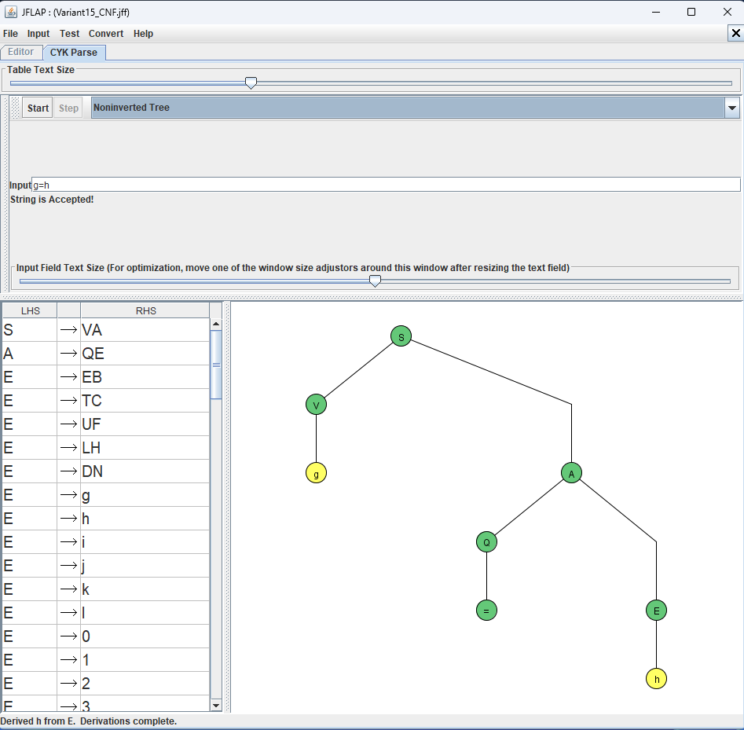

**2. `g=0` — принятие.**

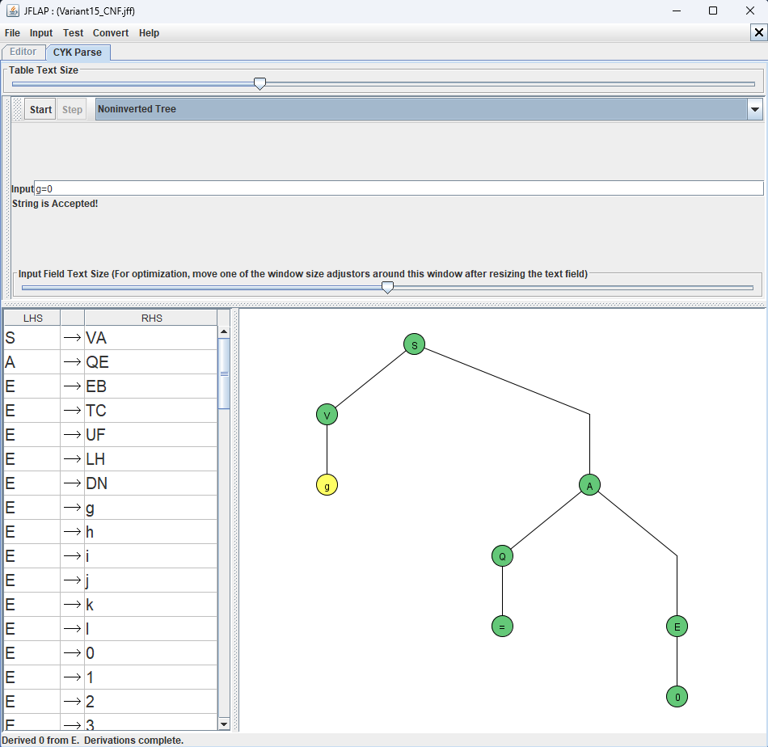

**3. `l=17` — принятие.**

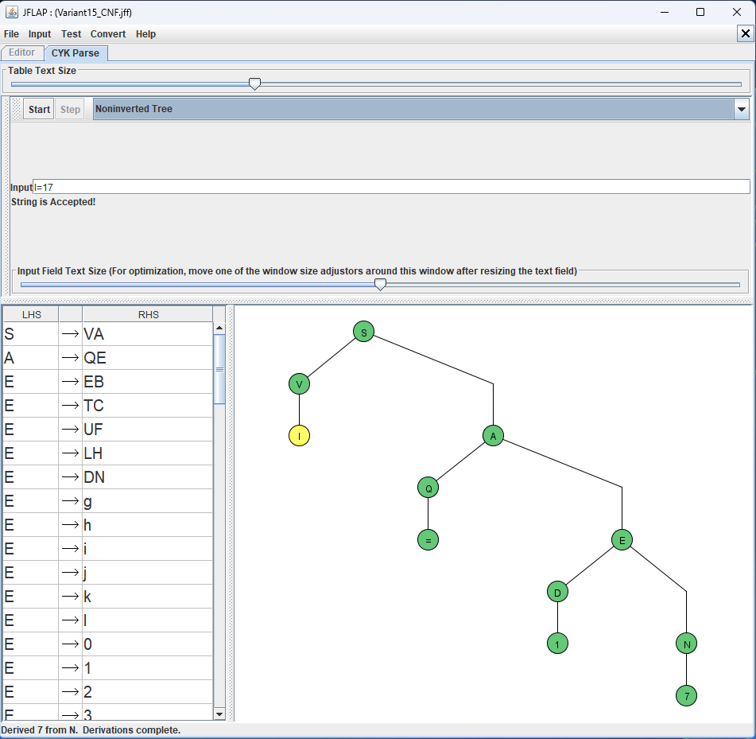

**4. `h=!i` — принятие.**

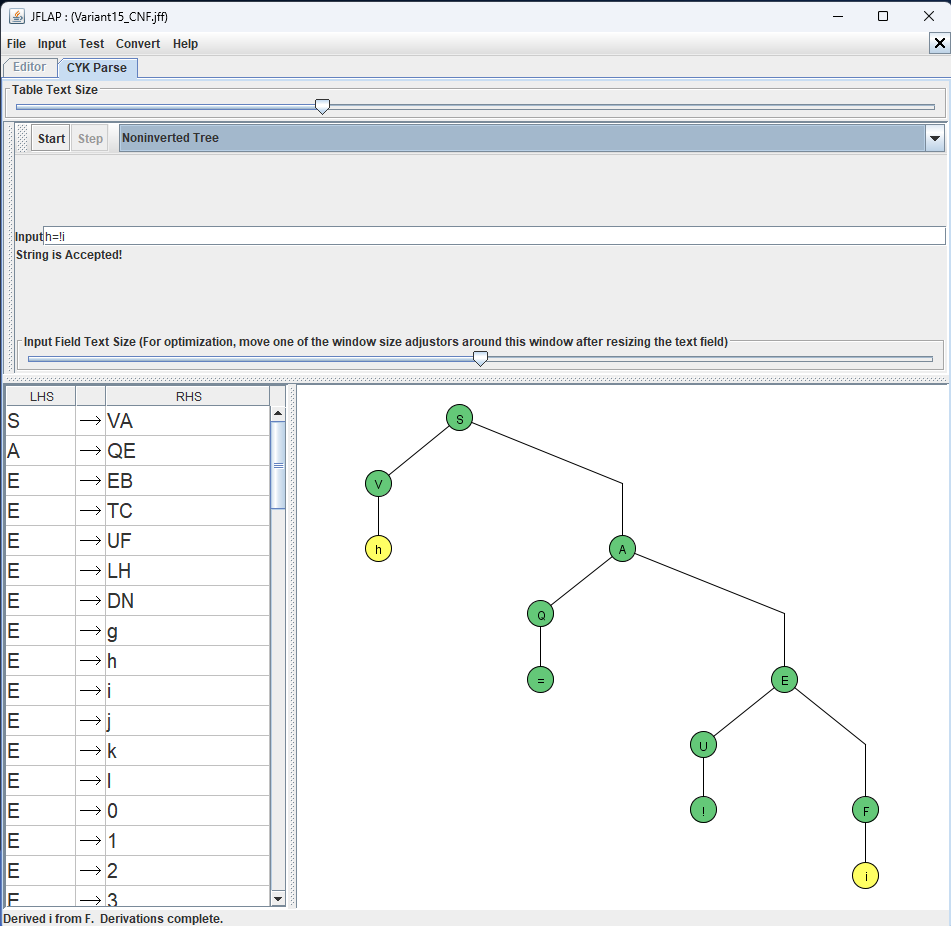

**5. `j=g|h&i` — принятие.**

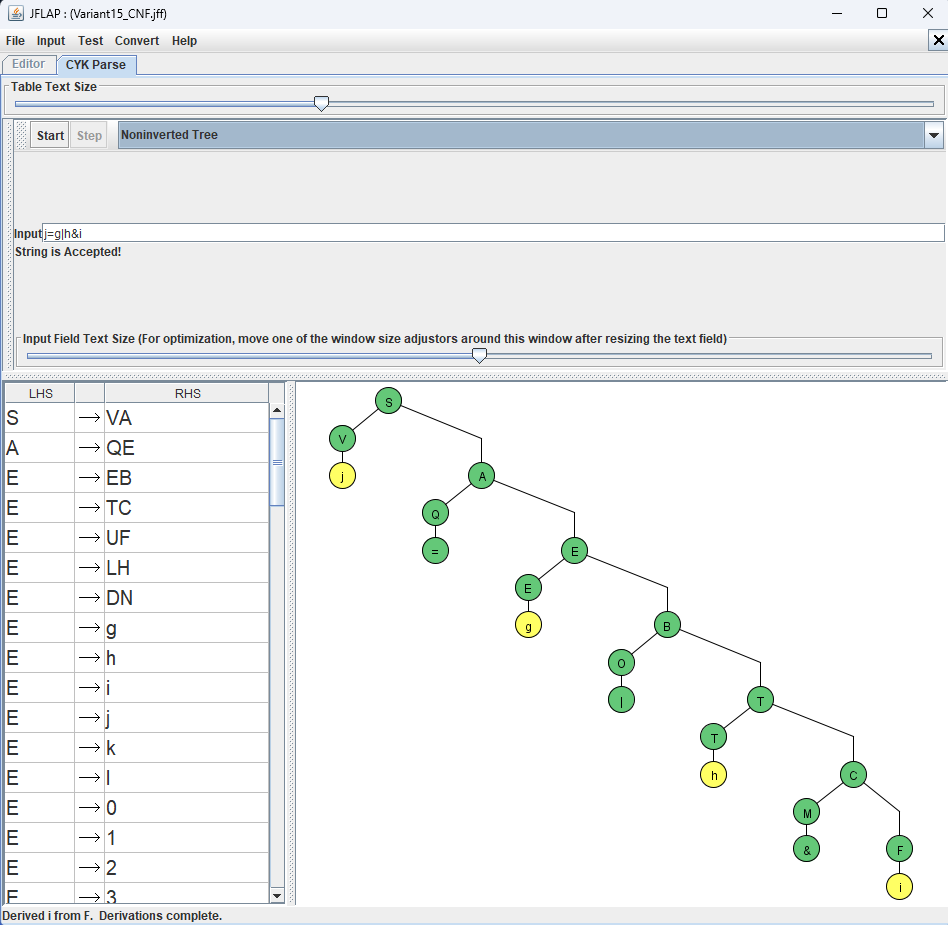

**6. `k=[g|h]&!l` — принятие.**

![CYK: k=[g|h]&!l](images/cyk_06_brackets.png)

**7. `g=8` — отклонение.**

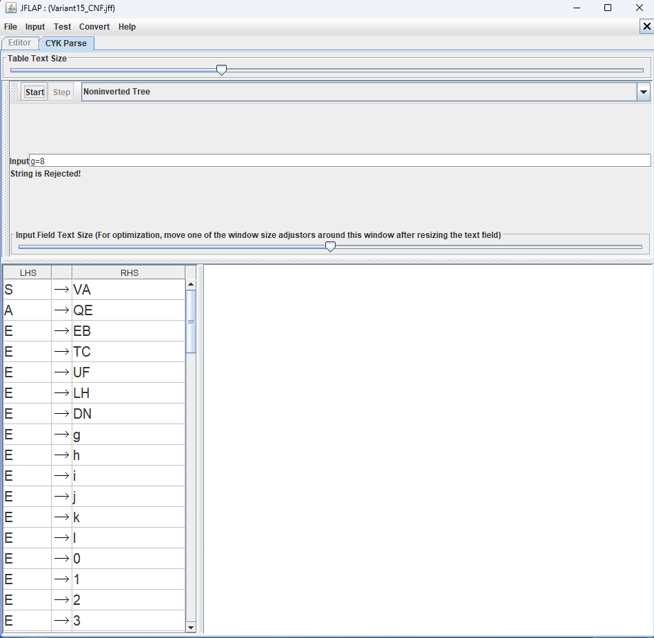

**8. `m=g` — отклонение.**

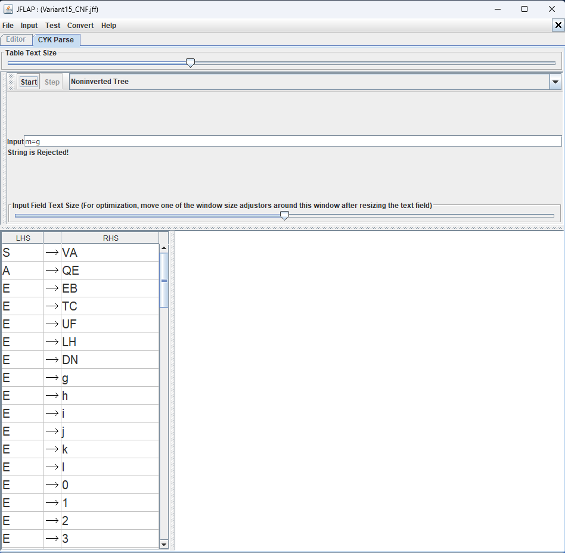

**9. `g=h&` — отклонение.**

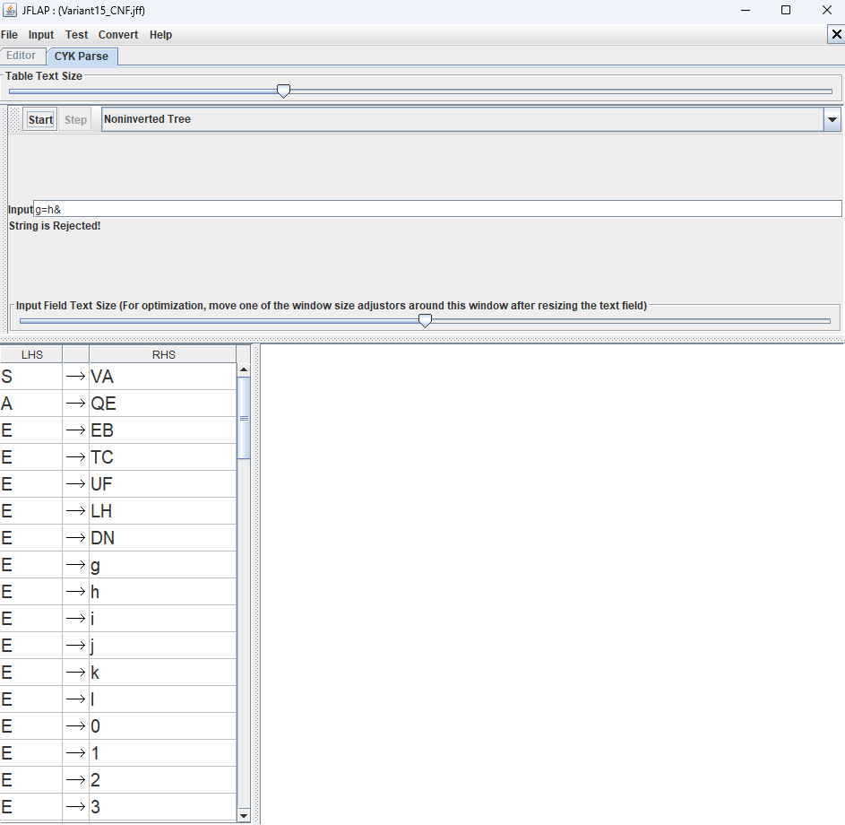

**10. `g=[h|i` — отклонение.**


## 4. Программная реализация алгоритма Кока—Янгера—Касами

Исходный код: [src/SyntaxAnalyzer.java](src/SyntaxAnalyzer.java). Программа написана на Java и читает продукции из файла `.jff`. Распознавание определяется загруженной грамматикой. Проверка вида выражения отдельными условиями или регулярным выражением не используется.

В режиме `cyk` проверяется соответствие грамматики НФХ. Обозначения нетерминалов — отдельные прописные латинские буквы, терминалы — отдельные символы, как в подготовленной модели JFLAP. Поддерживается также стандартное исключение `S → ε`, если начальный символ не встречается в правых частях.

Для входа $w=a_1\ldots a_n$ создаётся таблица $T[i,\ell]$, содержащая все нетерминалы, из которых выводится подстрока длины $\ell$, начинающаяся в позиции $i$. Её первая строка заполняется по терминальным продукциям:

$$T[i,1]=\{A:A\to a_i\in P\}.$$

Для $\ell\geq2$ перебираются все разбиения подстроки на две непустые части:

$$T[i,\ell]=\bigcup_{k=1}^{\ell-1}
\{A:A\to BC\in P,\ B\in T[i,k],\ C\in T[i+k,\ell-k]\}.$$

Цепочка принимается тогда и только тогда, когда $S\in T[1,n]$. Для пустой цепочки отдельно проверяется наличие `S → ε`.

В каждой ячейке вместе с нетерминалом сохраняются правило и первое найденное разбиение. По этим данным рекурсивная процедура `cykTree` восстанавливает одно дерево разбора, аналогично процедуре `REDUCE` в лекции. Множество нетерминалов в ячейке при этом содержит все найденные варианты. Для фиксированной грамматики построение таблицы требует $O(n^3)$ времени и $O(n^2)$ памяти.

### 4.1. Сборка и развёртывание

Требуется JDK версии 8 или новее. Внешние библиотеки, Maven и сервер не требуются. Нужно сохранить каталог `PR4` с грамматикой и подкаталогом `src`, открыть терминал в `PR4` и выполнить:

```text
javac -encoding UTF-8 -d out src/SyntaxAnalyzer.java
```

Скомпилированные классы создаются в каталоге `out`. Для запуска из этого каталога проекта используется:

```text
java -cp out SyntaxAnalyzer cyk Variant15_CNF.jff "g=h" "g=0" "l=17" "h=!i" "j=g|h&i" "k=[g|h]&!l" "g=8" "m=g" "g=h&" "g=[h|i"
```

Аргументы с цепочками заключаются в кавычки, чтобы терминал передал символы `|` и `&` программе. Для вывода таблицы и дерева одной цепочки:

```text
java -cp out SyntaxAnalyzer cyk Variant15_CNF.jff --trace "g=h"
```

### 4.2. Использование

Формат запуска:

```text
java -cp out SyntaxAnalyzer cyk grammar.jff [--trace] [цепочки...]
```

Без аргументов с цепочками программа читает их по одной в строке. Пустая строка и обозначение `eps` соответствуют $\varepsilon$; команда `exit` завершает ввод. Например:

```text
java -cp out SyntaxAnalyzer cyk Variant15_CNF.jff
```

Для каждой цепочки выводится `Input: ... | Result: Accept` или `Input: ... | Result: Reject`. В режиме `--trace` сначала выводится таблица, затем дерево для принятой цепочки и итоговый результат.

### 4.3. Проверка сборки и распознавания

Сборка выполнена без сообщений об ошибках:

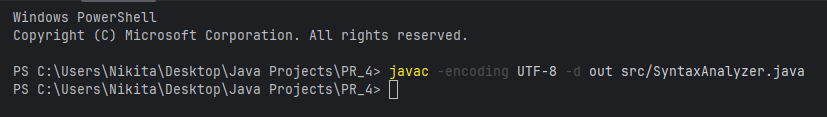

Программный CYK проверен на тех же десяти цепочках, что и модель JFLAP. Первые шесть цепочек приняты, последние четыре отвергнуты; все результаты совпадают с таблицей раздела 3:

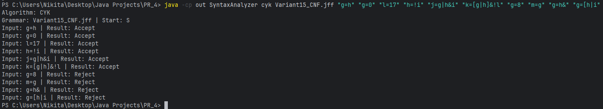

Для `g=h` проверен режим `--trace`. В первой строке таблицы присутствуют нетерминалы, выводящие отдельные символы. В ячейке `T[2,2]` находится `A`, порождающий `=h`; в итоговой ячейке `T[1,3]` находится `S`. Восстановленное дерево имеет листья `g`, `=`, `h`, результат — `Accept`:

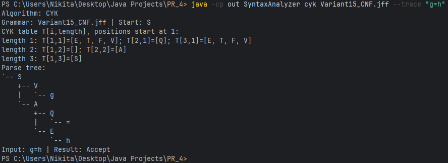

## 5. Программная реализация алгоритма Эрли

Режим `earley` реализует бесконтекстную разновидность алгоритма Эрли, описанную в разделе 9.3 лекции 9. Она работает с КСГ без требования НФХ, включая единичные и пустые продукции и левую рекурсию. Используется то же соглашение об односимвольных нетерминалах и терминалах файла JFLAP.

Ситуация хранит номер продукции, позицию точки в её правой части и позицию начала распознаваемой подстроки. Ситуации с одинаковой тройкой не добавляются повторно. Для восстановления одного дерева также сохраняются уже распознанные дочерние узлы.

Как в лекции, грамматика внутренне дополняется правилом $`S'\to\#S\#`$, а анализируемая цепочка — двумя граничными символами `#`. В файл `.jff` это правило не добавляется, пользователю вводить `#` не требуется. Начальное множество содержит $`[S'\to\bullet\#S\#,0]`$.

Применяются три операции:

1. **Предсказатель.** Если в $M_i$ есть $[A\to\alpha\bullet B\beta,q]$, в $M_i$ добавляются $[B\to\bullet\gamma,i]$ для всех продукций $B\to\gamma$.
2. **Считыватель.** Если в $M_i$ есть $[A\to\alpha\bullet b\beta,q]$ и очередной терминал равен $b$, в $M_{i+1}$ добавляется $[A\to\alpha b\bullet\beta,q]$.
3. **Завершатель.** Для $[B\to\gamma\bullet,q]\in M_i$ в $M_q$ находятся ситуации $[A\to\alpha\bullet B\beta,p]$, и в $M_i$ добавляются $[A\to\alpha B\bullet\beta,p]$.

Каждое множество обрабатывается до исчерпания очереди новых ситуаций. Для завершённых пустых подстрок сохраняются отдельные записи: если ожидающая ситуация появилась после пустого завершения, она также продвигается. Это обеспечивает обработку пустых продукций независимо от порядка добавления ситуаций.

При длине исходной цепочки $n$ критерием принятия является наличие $`[S'\to\#S\#\bullet,0]`$ в $M_{n+2}$. Для принятой цепочки извлекается дерево исходного символа `S` без служебных границ. Алгоритм хранит все различные ситуации; среди нескольких деревьев одной ситуации сохраняется один вариант.

### 5.1. Сборка, развёртывание и использование

Алгоритм находится в том же исходном файле и собирается командой из раздела 4.1. Повторная сборка при переключении режима не требуется.

Запуск десяти контрольных цепочек:

```text
java -cp out SyntaxAnalyzer earley Variant15_CNF.jff "g=h" "g=0" "l=17" "h=!i" "j=g|h&i" "k=[g|h]&!l" "g=8" "m=g" "g=h&" "g=[h|i"
```

Вывод множеств ситуаций и дерева:

```text
java -cp out SyntaxAnalyzer earley Variant15_CNF.jff --trace "g=h"
```

В текстовом выводе положение точки обозначается символом `.`. Например, завершённое дополненное правило отображается как `[S' -> #S#., 0]`. Восстановленное дерево и результат относятся к исходной цепочке `g=h`.

Интерактивный запуск:

```text
java -cp out SyntaxAnalyzer earley Variant15_CNF.jff
```

Пустая строка означает $\varepsilon$, команда `exit` завершает ввод. Для подстановки другой КСГ следует указать путь к её `.jff` вместо `Variant15_CNF.jff`.

### 5.2. Проверка распознавания

Программный алгоритм Эрли проверен на тех же десяти цепочках. Первые шесть цепочек приняты, последние четыре отвергнуты. Результаты совпадают с программным CYK и проверками JFLAP:

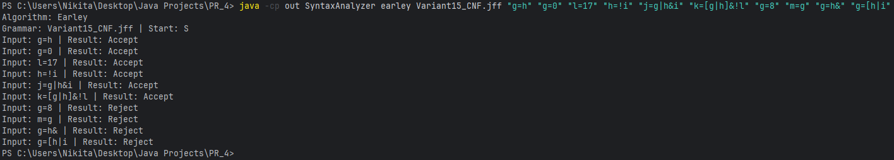

Для `g=h` проверен режим `--trace`. Начальная ситуация имеет вид `[S' -> .#S#, 0]`; после первой служебной границы предсказатель добавляет правила для `S` и `V`. После считывания `g` завершается `V`, затем ожидается знак присваивания:

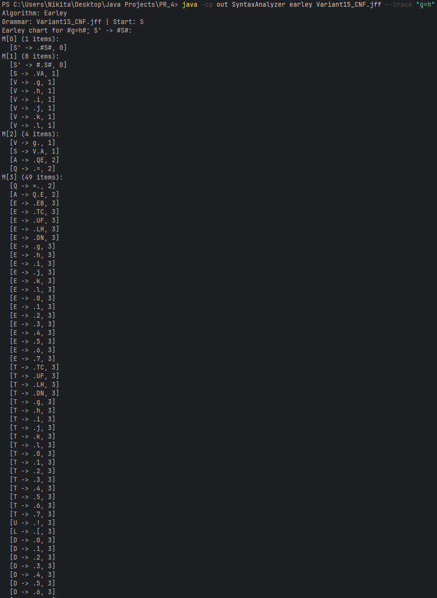

В `M[4]` завершены правые части для `h`, оператор присваивания и исходный начальный символ `S`. После последней служебной границы в `M[5]` получена ситуация `[S' -> #S#., 0]`. Дерево имеет листья `g`, `=`, `h`; результат — `Accept`:

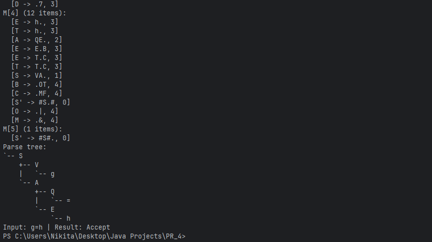

## 6. Использованные источники

1. «Практическая работа № 4», файл `Pr_04.pdf`, вариант 15 — постановка языка.
2. «Лекция 9. Синтаксический анализ. Часть 1», файл `09 (1).pdf`, разделы 9.3 и 9.4; презентация `09_Slides (1).pdf`, слайды 8–25 — описания алгоритмов Эрли и Кока—Янгера—Касами, процедуры восстановления дерева.
3. Jay Earley. *An Efficient Context-Free Parsing Algorithm*. Communications of the ACM, 13(2), 94–102, 1970. [Первоисточник алгоритма Эрли](https://doi.org/10.1145/362007.362035), указанный в литературе к лекции 9.
4. [Официальная инструкция JFLAP: CYK Parser](https://jflap.org/csed/jflap/tutorial/grammar/cyk/index.html) — режим распознавания и просмотр вывода.
